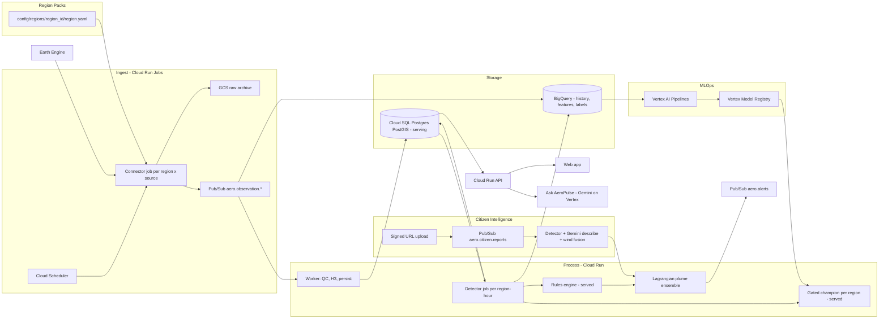
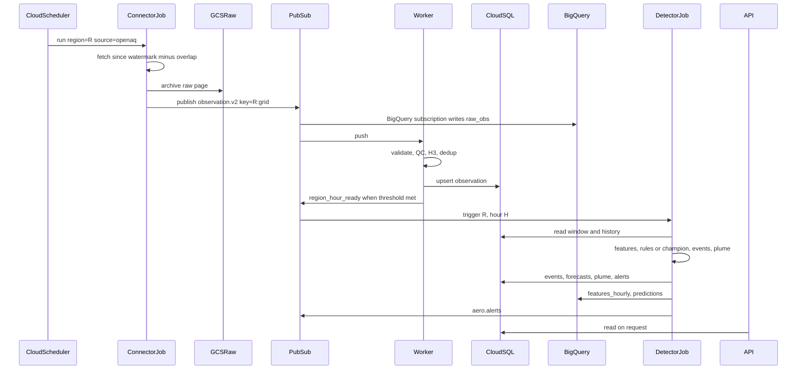
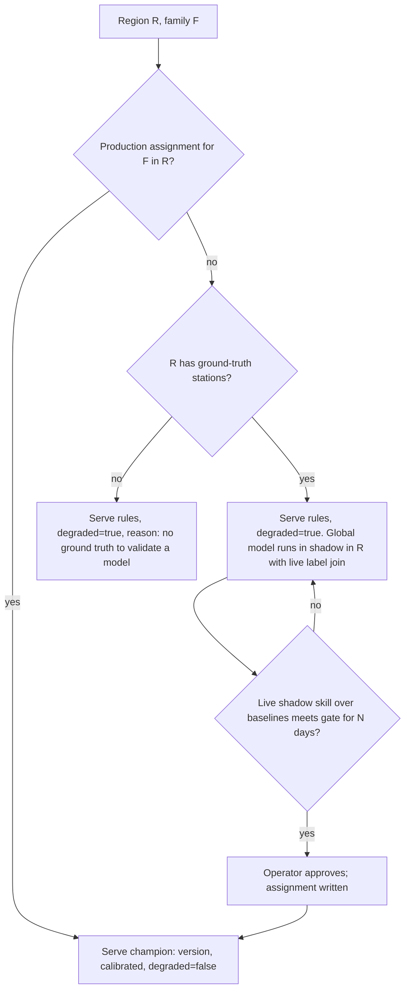
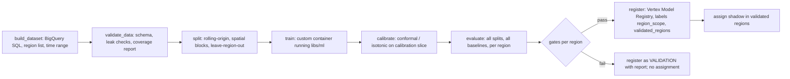

# AeroPulse Global — Low-Level Design

Status: proposal for review. Scope: take AeroPulse from a Punjab–Haryana–Delhi NCR build to a region-agnostic product that can be pointed at any city, country, or continent, runs on Google Cloud, serves models that beat honest baselines, and turns citizen smoke photos into plume intelligence.

Read first: [README.md](../README.md) (setup), [architecture.md](architecture.md) (current system), [AGENTS.md](../AGENTS.md) (contributor rules).

## How to read this document

- **Section 1** is a review of the current code. Every gap cites a file and line so it can be checked.
- **Sections 2–10** are the design: architecture, region packs, ingest, data model, ML, plume, citizen photos, Ask AeroPulse, API and frontend.
- **Sections 11–13** cover security, the rule changes this design needs, and a phased build plan with exit criteria.
- **Numbers.** Any figure presented as a *result* comes from a file in this repo, and the file is named. Any figure presented as a *setting* or *target* is labelled that way and must be tuned or confirmed before it is quoted to users. External facts (provider latencies, dataset ids) are marked "confirm" where they need checking against the provider's own documentation.
- **Decisions already made:**
  1. *Hybrid with adapters.* Google Cloud is the primary deployment. The current Docker stack keeps working behind the same interfaces for development and for Demo.
  2. *Two-stage photo analysis.* A trained detector decides whether smoke is present. Gemini only writes the description, and its output is labelled corroborative.

## Contents

1. [Current-state review](#1-current-state-review)
2. [Target architecture](#2-target-architecture)
3. [Region Pack](#3-region-pack-pluggable-geography)
4. [Pluggable connectors and near-real-time ingest](#4-pluggable-connectors-and-near-real-time-ingest)
5. [Data model](#5-data-model)
6. [ML pipeline](#6-ml-pipeline)
7. [Plume intelligence](#7-plume-intelligence)
8. [Citizen photo smoke intelligence](#8-citizen-photo-smoke-intelligence)
9. [Ask AeroPulse](#9-ask-aeropulse)
10. [API and frontend](#10-api-and-frontend)
11. [Security and operations](#11-security-and-operations)
12. [Proposed AGENTS.md amendments](#12-proposed-agentsmd-amendments)
13. [Phased roadmap and acceptance criteria](#13-phased-roadmap-and-acceptance-criteria)

---

## 1. Current-state review

The current build is honest about what it is: rules on the live path, trained models in shadow, Demo separated from Live. The gaps below are what stops it from (a) working outside one corridor, (b) predicting well, and (c) understanding citizen photos.

### 1.1 The region is hardcoded

There is no region or country setting anywhere. The corridor is repeated in roughly 25 places, and changing one does not change the others.

| Where | What is fixed |
| --- | --- |
| [libs/geospatial/aeropulse_geospatial/grid.py](../libs/geospatial/aeropulse_geospatial/grid.py) line 14 | `DEFAULT_AOI = (73.5, 27.0, 78.5, 32.5)` and `in_default_aoi()` |
| [connectors/openaq/aeropulse_connector_openaq/connector.py](../connectors/openaq/aeropulse_connector_openaq/connector.py) line 53 | `DEFAULT_BBOX = (73.8, 27.5, 78.5, 32.2)` |
| [connectors/firms/aeropulse_connector_firms/connector.py](../connectors/firms/aeropulse_connector_firms/connector.py) line 54 | Same bbox |
| [connectors/openmeteo/aeropulse_connector_openmeteo/connector.py](../connectors/openmeteo/aeropulse_connector_openmeteo/connector.py) line 89 | `DEFAULT_SITES`: five corridor sites (Delhi NCR, Gurugram, Karnal, Ludhiana, Amritsar) |
| [config/sources.yaml](../config/sources.yaml) | A `bbox` key for OpenAQ and FIRMS that **no code reads** |
| [libs/geospatial/aeropulse_geospatial/gazetteer.py](../libs/geospatial/aeropulse_geospatial/gazetteer.py) lines 56–91 | A fixed list of corridor places with Indian state names |
| [libs/geospatial/aeropulse_geospatial/population.py](../libs/geospatial/aeropulse_geospatial/population.py) | Five fixture points plus a fallback density |
| [libs/intelligence/aeropulse_intelligence/risk.py](../libs/intelligence/aeropulse_intelligence/risk.py) | `DENSITY_SCALE_PER_KM2` tuned to central Delhi |
| [libs/contracts/aeropulse_contracts/feature_spec.py](../libs/contracts/aeropulse_contracts/feature_spec.py) line 150 | `_STUBBLE_MONTHS = {4, 5, 10, 11}` drives the `is_stubble_season` feature |
| [libs/contracts/aeropulse_contracts/hazard.py](../libs/contracts/aeropulse_contracts/hazard.py) line 33 | `HAZARD_THRESHOLD_UGM3 = 121.0` (CPCB "Very Poor") |
| [libs/copilot/aeropulse_copilot/tools.py](../libs/copilot/aeropulse_copilot/tools.py) line 32 | `CPCB_PM25_BANDS`; the system prompt scopes answers to the corridor |
| [libs/ml/aeropulse_ml/registry.py](../libs/ml/aeropulse_ml/registry.py) line 97 | `geography: str = "punjab-haryana-delhi-ncr"` on every model record |
| [libs/intelligence/aeropulse_intelligence/snapshot.py](../libs/intelligence/aeropulse_intelligence/snapshot.py) line 27 | `MODEL_DERIVED_SOURCES = {"openmeteo", "cams"}` — source ids baked into fusion logic |
| `infrastructure/db/migrations/0001_init.sql` | `grid_cell.region_id/state/district/city` exist but nothing writes them |
| `frontend/web/src/components/map/AeroMap.tsx` | `CORRIDOR_VIEW` is the initial map centre |
| `frontend/web/src/utils/geo.ts` | `CORRIDOR_BOUNDS`, `PUNJAB_FIRE_CENTER`, `TRANSPORT_BEARING_DEG = 146`, `WIND_SPEED_MS = 6` |
| `frontend/web/scripts/build-geography.mjs` | Basemap coastlines and borders clipped to South Asia |
| `frontend/web/src/utils/format.ts`, `src/api/adapters.ts` | `timeZone: 'Asia/Kolkata'`; `toRegion()` maps latitude bands to Punjab/Haryana/Delhi |
| `frontend/web/src/utils/aqi.ts` | CPCB PM2.5 bands |

### 1.2 Connectors are not pluggable

- [apps/connector/aeropulse_connector_app/registry.py](../apps/connector/aeropulse_connector_app/registry.py) imports every connector package by name and declares a fixed `SOURCE_SPECS` tuple. There is no entry-point or plugin discovery.
- A `SourceSpec.factory` receives only a fixture path. Constructor arguments such as `bbox` and `sites` exist on the connectors but cannot be set from configuration.
- `FetchRequest.bbox` exists in the SDK but the runner never fills it.
- Of 13 connectors, 3 are live (OpenAQ, Open-Meteo, FIRMS). Eight (Sentinel-5P, MODIS, CAMS, INSAT, Bhuvan, ICAR, industry, OSM) are fixture replays of about 20 lines each. CPCB and IMD are fixture-only; IMD is disabled.
- Raw archiving is on only for CPCB, and it archives the fixture rather than a live response.

### 1.3 Bugs and weaknesses on the served path

These change what an operator sees today and should be fixed before anything else.

1. **Forecast wind is thrown away.** The Open-Meteo connector requests `past_days=2, forecast_days=1` but defaults to `drop_future_hours=True` (connector line 159). Only observed and analysis hours survive, so the plume has no forecast wind to use.
2. **The plume is a straight line that stops at about 37 km.** [libs/intelligence/aeropulse_intelligence/forecast.py](../libs/intelligence/aeropulse_intelligence/forecast.py) holds one wind vector constant for all horizons (3–48 h) and walks the best-aligned H3 neighbour `km / 0.93` times, capped at 40 steps (lines 105–116). 40 × 0.93 km ≈ 37 km, so a 24 h forecast at 3 m/s (about 259 km of travel) is truncated by a factor of about seven. There is no lateral spread, a missing wind becomes zero (lines 53–54), and the output is one cell per horizon rather than a footprint.
3. **IDW mixes hours.** [libs/intelligence/aeropulse_intelligence/detect.py](../libs/intelligence/aeropulse_intelligence/detect.py) lines 76–82 pass the whole `snapshot.air_quality` list to `estimate_pm25`, which has no time filter ([estimator.py](../libs/intelligence/aeropulse_intelligence/estimator.py) lines 40–47). Readings from different hours are averaged together, and model-derived values are not excluded from the interpolation even though they are excluded when picking the representative reading.
4. **Anomaly detection never sees history.** The worker calls `process_snapshot(snapshot, repository.event_store)` without `history_by_grid` ([apps/worker/aeropulse_worker/pipeline.py](../apps/worker/aeropulse_worker/pipeline.py) line 264), so every cell uses the absolute-threshold branch in `anomaly.py`.
5. **CAMS blend is not located.** `_cams_pm25` in `detect.py` (lines 159–164) takes the last CAMS raster value anywhere in the snapshot, regardless of where the event is.
6. **Hazard and peak ignore champions.** `apps/api/aeropulse_api/hazard_store.py` always serves the carry-forward rule with `degraded=True`, even when a champion is registered.

### 1.4 ML: nothing trained is served, and the trained models are weak or stale

Local registry ([models/index.json](../models/index.json)):

| Model | Stage | Evidence |
| --- | --- | --- |
| `hgb-pm25-202609081643` | PRODUCTION | Temporal skill vs persistence 0.43, spatial 0.32. Trained on Open-Meteo (CAMS) values at 5 corridor sites, so the target is itself a smooth model output. Built on `grid-features-0.4.0`; the current spec is `ml-features-2.0.0` ([feature_spec.py](../libs/contracts/aeropulse_contracts/feature_spec.py) line 37), so the loader rejects it. |
| `hgb-anomaly-202609081643` | VALIDATION | Recall 0.046, F1 0.086 against the CPCB "Very Poor" label |
| `hgb-source-202609081643` | VALIDATION | Macro F1 0.61; the `traffic` class has F1 0 |
| `hgb-forecast-202609081643` | VALIDATION | 3 h skill vs persistence 0.17; does not pass every horizon |

The research notebooks are much stronger but have not reached `libs/ml`:

| Notebook evidence | Figure | Source file |
| --- | --- | --- |
| Dataset | 1,705,252 station-hours, 149 OpenAQ stations across India, 567 days (1.55 years); 1 winter and 1 post-monsoon cycle against a roadmap target of 3 | `AeroPulse_ML_Notebooks/pm25_estimator/artifacts/pm25/phase7/historical_coverage_audit.json` |
| 24 h PM2.5, purged rolling-origin, 5 folds | Tuned model mean R² 0.226, RMSE 27.34 vs persistence 30.51; all gates passed: false | `.../phase7/tuning/tuning_report.json` |
| Feature importance by group | Temporal/history group dominates (RMSE +20.79 when permuted); the next groups add +0.43 and +0.17 | same file |
| 24 h hazard classifier | PR-AUC 0.523, ROC-AUC 0.829; 92.6% of 1,678 events detected, median lead 24 h; false-alarm share 65% | `.../phase7/peak_hazard/peak_hazard_report.json` |
| Hazard spatial transfer | PR-AUC 0.760 with a coordinate-free ("transferable") feature set vs 0.758 with the baseline feature | `AeroPulse_ML_Notebooks/anomaly_detector/artifacts/anomaly/phase7_spatial/phase7_report.json` |
| Hazard rolling-origin stability | PR-AUC 0.575 ± 0.165; worst fold post-monsoon+winter; positive rate swings 10× between folds | `.../phase9_rolling/phase9_report.json` |

Structural ML gaps:

- **No forecast weather as input.** Features use weather within ±3 h of the hour. The notebooks list "observations at t rather than forecasts" as a blocker.
- **One region, tiny spatial holdout.** Production trains on 5 cells; the spatial split holds out one cell. The anomaly bundle stores per-cell baselines, so new cells fall back to a global median.
- **Train/serve shift for cells without a station.** The estimator is trained only on cells with their own PM2.5 history. A cell without a station loses its history, co-pollutant, and distance features but still passes the 50% completeness floor in `inference.py`.
- **Weak evaluation in `libs/ml`.** One 80/20 time cut with no purge, one held-out cell, "season" = last month. The notebooks already use purged rolling-origin evaluation; `libs/ml` does not.
- **No monitoring against ground truth.** The drift monitor watches input distributions only and joins no delayed labels.
- **No retraining schedule** and no calibration in `libs/ml` (hazard records `calibration="none"`).
- Artifacts are local `joblib` files; `s3://` URIs are mapped back to local paths.

### 1.5 Citizen reports: photos are stored, never looked at

- [libs/intelligence/aeropulse_intelligence/cv.py](../libs/intelligence/aeropulse_intelligence/cv.py): `classify_report` runs a keyword regex over `observation_type + notes`. The image bytes are never read. No EXIF, no model, no vision call exists anywhere in the codebase.
- Reports live only in `EventStore.citizen_reports` (process memory, lost on restart). There is no database table, and the `aero.citizen.reports` topic in `libs/common/aeropulse_common/topics.py` is never used.
- [apps/api/aeropulse_api/routers/citizen.py](../apps/api/aeropulse_api/routers/citizen.py) lines 76–81 auto-accept a report only when its cell holds an event whose severity is **not** HIGH or CRITICAL. Reports in the cells that matter most are never linked. This looks inverted; at minimum it needs a stated reason.
- `observed_at` is the server's `now()`. Lat/lon are free-form numbers anyone can edit. Device accuracy from the browser is dropped. The reporter identity in the token is ignored. There is no AOI check and no rate limit per reporter.
- No endpoint serves the stored photo back. Object names come from user filenames plus a one-second timestamp, so two uploads with the same name in the same second collide. When MinIO is absent the upload "succeeds" with a URI that points at nothing.
- Citizen reports are not evidence in the event engine; the only citizen evidence is a seeded demo string.

### 1.6 Security

- `jwt_secret` defaults to a known development string ([libs/common/aeropulse_common/settings.py](../libs/common/aeropulse_common/settings.py) line 27). A deployment that forgets `AEROPULSE_JWT_SECRET` accepts tokens anyone can mint. It should fail closed.
- `infrastructure/docker/compose.yaml` hardcodes MinIO keys and the Postgres password in connection strings. These are development values, but they belong in `.env` or a secret store.
- The optional OIDC path in [libs/auth/aeropulse_auth/jwt.py](../libs/auth/aeropulse_auth/jwt.py) reads the algorithm from the unverified token header. The accepted algorithms must be pinned.
- Gemini is called with an API key (`google-genai` with `api_key=`). On Google Cloud it should use Vertex AI with the service account's identity (ADC), so no key exists to leak.
- The browser bundle carries `VITE_API_TOKEN`; acceptable for a demo, not for a public deployment.

---

## 2. Target architecture

### 2.1 Principles kept from the current build

These stay non-negotiable. The design adds capability around them, not instead of them.

- Vendor JSON stops at `normalize()`. Only shared contracts travel further.
- A missing key means *not configured* and zero records, never a silent fixture.
- The served answer for detection, anomaly, likelihood, forecast, and plume comes from rules or a gated trained model. No language model on that path.
- Every served prediction states its version and whether it is degraded; hazard also states whether it is calibrated.
- Ground stations outrank model-derived values for the same cell-hour.
- Demo works with no API. Live never paints Demo data.

### 2.2 Picture



### 2.3 Components

| Component | GCP (primary) | Local (dev / Demo) | Responsibility |
| --- | --- | --- | --- |
| Region registry | `config/regions/*` baked into images; `region` table | Same files | Geography, timezone, AQI standard, sources, priors |
| Scheduler | Cloud Scheduler → Cloud Run Jobs | `apps/connector` interval loop (unchanged) | Run each (region, source) on its cadence |
| Connector job | Cloud Run Job `aeropulse-connector --region R --source S` | Same CLI in compose | Fetch, normalize, archive raw, publish |
| Event bus | Pub/Sub | Redpanda (Kafka) | Four observation streams plus forecast, citizen, alerts, ML control |
| Raw archive | Cloud Storage `gs://<project>-aeropulse-raw` | MinIO | Original vendor payloads; never read by the map |
| Worker | Cloud Run service with Pub/Sub push | `apps/worker` consumer | Validate, QC, grid, dedup, persist observations |
| Detector | Cloud Run Job per region-hour (triggered) | Worker's existing `DetectionTrigger` | Build features from the DB window, score, events, plume |
| Serving DB | Cloud SQL for PostgreSQL + PostGIS | TimescaleDB + PostGIS | What the API reads |
| Analytics | BigQuery | Optional Parquet dump | Full history, features, labels, predictions, eval metrics |
| Model store | Vertex AI Model Registry + GCS artifacts | `models/index.json` + joblib | Versions, gates, region coverage |
| Training | Vertex AI Pipelines (KFP) | `uv run aeropulse-ml train` | Dataset → train → evaluate → gate → register |
| Earth Engine | Earth Engine API (service account) | Fixture replays | Satellite and static layers per region |
| Vision | Vertex AI (AutoML object detection endpoint) + Cloud Vision SafeSearch | ONNX detector file, SafeSearch skipped with a stated reason | Smoke/fire detection, privacy filtering |
| LLM | Gemini on Vertex AI (ADC) | `google-genai` with API key | Ask AeroPulse; photo descriptions |
| Cache | Memorystore for Redis | Redis | API response cache |
| Alerts | Pub/Sub `aero.alerts` → push subscribers (webhook, email, FCM) | Kafka topic | Fan-out of operator alerts |
| Observability | Cloud Logging, Cloud Trace, Cloud Monitoring (via OTel) | OTel collector debug exporter | Traces, metrics, logs |

### 2.4 Why the detector becomes its own job

Today the worker keeps a 48-hour in-memory snapshot and runs detection every 30 s or 500 messages. On Cloud Run, instances scale out and are recycled, so in-memory state is neither shared nor durable. The split is:

- **Worker** (stateless, push): one message in, validate, persist, acknowledge. Idempotent through the existing `dedup_key` unique indexes.
- **Detector** (per region-hour): reads the window it needs from the serving DB (current hour plus the history needed for anomaly baselines), runs `process_snapshot` with `history_by_grid` filled, writes events, forecasts, plume, and alerts. Triggered by Cloud Scheduler every N minutes per active region (setting: 10 min) and also by an `aero.control.region_hour_ready` message when the worker has seen enough new records for a region-hour.

Locally, the existing `DetectionTrigger` keeps working; it calls the same detector function.

### 2.5 Adapter interfaces

Each interface lives in `libs/common/aeropulse_common/platform/` with two implementations. `AEROPULSE_PLATFORM=local|gcp` picks them at startup in one factory module; nothing else branches on platform.

```python
class EventBus(Protocol):
    def publish(self, topic: str, envelope: KafkaEnvelope, *, ordering_key: str | None,
                attributes: Mapping[str, str]) -> None: ...
    def subscribe(self, topics: Sequence[str], group: str) -> AsyncIterator[BusMessage]: ...

class ObjectStore(Protocol):
    def put(self, key: str, data: bytes, *, content_type: str) -> str: ...  # returns URI, raises on failure
    def get(self, uri: str) -> bytes: ...
    def signed_upload_url(self, key: str, *, content_type: str, max_bytes: int, ttl_s: int) -> str: ...
    def signed_download_url(self, uri: str, *, ttl_s: int) -> str: ...

class ServingRepo(Protocol):  # superset of today's TimescaleRepository
    def upsert_observations(self, rows: Sequence[Observation]) -> int: ...
    def window(self, region_id: str, start: datetime, end: datetime) -> FeatureSnapshot: ...
    def history(self, region_id: str, grid_ids: Sequence[str], hours: int) -> dict[str, list[float]]: ...
    # events, forecasts, plume, citizen, health ... as today, all keyed by region_id

class AnalyticsSink(Protocol):
    def write(self, table: str, rows: Sequence[Mapping[str, object]]) -> None: ...

class ModelStore(Protocol):
    def champion(self, family: str, region_id: str) -> ModelRecord | None: ...
    def load(self, record: ModelRecord) -> ModelBundle: ...
    def register(self, record: ModelRecord, artifact_path: Path) -> ModelRecord: ...

class LLMClient(Protocol):
    def generate(self, *, system: str, contents: Sequence[Content], tools: Sequence[Tool] | None,
                 response_schema: dict | None) -> LLMResponse: ...
```

Behaviour changes that come with the adapters:

- `ObjectStore.put` **raises** when the write fails. Today `put_raw_json` returns a URI for an object that was never written. A citizen upload that did not land must not look as if it did.
- The Kafka topic names in `topics.py` are reused unchanged as Pub/Sub topic ids (Pub/Sub ids allow dots). One table in `topics.py` stays the single source of topic names for both buses.

---

## 3. Region Pack (pluggable geography)

A **region pack** is a directory that holds everything that is specific to a place. Code reads geography only through it. Adding a region is a data change plus an onboarding run, not a code change.

### 3.1 Layout

```text
config/regions/
  in-north/                       # today's corridor, migrated first
    region.yaml
    gazetteer.parquet             # generated by `aeropulse-region init`
    population_h3r8.parquet       # generated
    stations.json                 # discovered ground stations (cached)
    basemap.geojson               # optional clipped coastline/borders for the web app
  us-ca-central-valley/
    region.yaml
    ...
config/aqi_standards/
  cpcb_in.yaml
  us_epa.yaml
  eu_eaqi.yaml
```

### 3.2 `region.yaml` schema

Validated by a Pydantic model `RegionPack` in a new `libs/regions/aeropulse_regions/` package (`extra="forbid"`, like every other contract).

```yaml
schema_version: region.v1
region_id: in-north                  # lowercase, [a-z0-9-], stable forever
display_name: "Punjab–Haryana–Delhi NCR"
country_codes: [IN]                  # ISO 3166-1 alpha-2
geometry:
  bbox: [73.5, 27.0, 78.5, 32.5]     # min_lon, min_lat, max_lon, max_lat
  polygon_uri: null                  # optional GeoJSON for non-rectangular regions
timezone: Asia/Kolkata               # IANA; display only — storage stays UTC
h3_resolution: 8                     # AGENTS.md: 1 km cells
aqi_standard: cpcb_in                # key into config/aqi_standards/
map_view: { lon: 76.2, lat: 29.8, zoom: 6.2 }
seasonal_priors:
  - name: crop_residue_burning
    months: [4, 5, 10, 11]           # replaces _STUBBLE_MONTHS
    feature: is_burning_season
climate_zone: BSh                    # Köppen-Geiger class, filled by `init`; used for model transfer
sources:                             # replaces the hardcoded SOURCE_SPECS for this region
  - id: openaq
    enabled: true
    interval_seconds: 900
    params: { parameters: [pm25, pm10], monitor_only: true }
    secret_ref: projects/<p>/secrets/openaq-api-key   # name only; value lives in Secret Manager
  - id: openmeteo
    enabled: true
    interval_seconds: 3600
    params: { site_strategy: h3_r5_centroids, keep_forecast_hours: 72 }
  - id: firms
    enabled: true
    interval_seconds: 900
    params: { product: VIIRS_NOAA20_NRT, day_range: 1 }
    secret_ref: projects/<p>/secrets/firms-map-key
  - id: earthengine
    enabled: true
    interval_seconds: 86400
    params: { products: [s5p_no2, s5p_aer_ai, maiac_aod, dynamic_world, worldpop] }
model_derived_sources: [openmeteo, cams]   # replaces MODEL_DERIVED_SOURCES constant
ground_truth_sources: [openaq, cpcb]       # which sources may be used as ML labels
gazetteer: { source: geonames, min_population: 10000 }
population: { source: worldpop, year: 2020 }
demo: { enabled: true }                    # region has a scripted Demo scenario
```

Rules enforced by the validator:

- A source listed in `ground_truth_sources` must not also be in `model_derived_sources`. This keeps "CAMS is not station truth" mechanical.
- `secret_ref` holds a name, never a value. A value-shaped string (long base64, a known key prefix) fails validation.
- `h3_resolution` must equal the platform setting (8) unless a later ADR changes it.

### 3.3 AQI standards are data, not constants

`config/aqi_standards/<key>.yaml`:

```yaml
key: cpcb_in
name: "CPCB National Air Quality Index (India)"
source_url: "<official publication URL>"
averaging: 24h
pollutants:
  pm25:
    unit: ug/m3
    bands:          # [low, high, label] — copied from the official table, never edited by hand
      - [0, 30, Good]
      - [31, 60, Satisfactory]
      - [61, 90, Moderate]
      - [91, 120, Poor]
      - [121, 250, "Very Poor"]
      - [251, null, Severe]
hazard_label: "Very Poor"     # the band whose lower bound becomes the hazard threshold
```

- A new `AqiStandard` class (`libs/regions/aeropulse_regions/aqi.py`) exposes `band(pollutant, value)`, `hazard_threshold(pollutant)`, and `name`.
- It replaces `CPCB_PM25_BANDS` and `cpcb_band()` in copilot `tools.py`, `HAZARD_THRESHOLD_UGM3` in `hazard.py`, the CPCB text in `service.py` and the system prompt, and `frontend/web/src/utils/aqi.ts` (the web app receives bands from `GET /api/v1/regions/{id}`).
- India keeps CPCB. The US EPA and EU EAQI files are created from the official tables when the first region that needs them is onboarded; the values are not reproduced here because they must be copied from the publication, with `source_url` filled.
- `HazardCell.threshold_ugm3` already exists on the contract; it is now filled from the region's standard and the response adds `aqi_standard`.
- This needs an AGENTS.md change (Section 12): today the rule says labels are CPCB, never EPA.

### 3.4 Onboarding a region: `aeropulse-region init`

New CLI in `libs/regions` (entry point `aeropulse-region`).

```bash
uv run aeropulse-region init --id us-ca-central-valley \
  --name "California Central Valley" --bbox -122.5 35.0 -118.5 40.5 \
  --timezone America/Los_Angeles --aqi us_epa
```

Steps, each idempotent and writing into the pack directory:

1. **Validate** the bbox (positive area, inside ±180/±90) and write a skeleton `region.yaml`.
2. **Discover ground stations.** OpenAQ v3 `/locations?bbox=…&parameters_id=2&monitor=true` (reference-grade only, as today). Write `stations.json`. If zero stations are found, the pack is marked `ground_truth: none` and the region can only run rules with `degraded=true`; ML cannot be validated there.
3. **Place weather sample sites.** H3 resolution-5 cell centroids covering the bbox (about 250 km² per cell; setting), capped by a `max_sites` setting so Open-Meteo request volume stays bounded. Replaces the five hand-picked `DEFAULT_SITES`.
4. **Gazetteer.** Places above `min_population` from GeoNames (or an OSM extract) inside the polygon, with admin-1/admin-2 names. Replaces `gazetteer.py`'s fixed list for this region.
5. **Population.** WorldPop or GHSL aggregated to H3 resolution 8 through Earth Engine; write `population_h3r8.parquet`. Replaces the five-point fixture and the Delhi-calibrated `DENSITY_SCALE_PER_KM2` (scale becomes the region's own percentile).
6. **Climate zone.** Majority Köppen-Geiger class over the bbox from a public raster (confirm dataset choice); used for model transfer in Section 6.5.
7. **Grid cells.** Write `grid_cell` rows (H3 r8, polygon, `region_id`, admin names) — the columns already exist and are currently empty.
8. **Basemap clip** for the web app (optional).
9. **Register** the region in the `region` table and print a health summary: stations found, sites placed, sources configured vs *not configured*.

An ADMIN-only API (`POST /api/v1/admin/regions`) runs the same steps as a Cloud Run Job for operators who do not have a shell.

### 3.5 `region_id` everywhere

| Layer | Change |
| --- | --- |
| Contracts | `region_id: str` added to `Observation`, `MeteorologicalObservation`, `FireObservation`, `RasterObservation`, `GridFeature`, `PollutionEvent`, `ForecastResult`, `CitizenReport`, `Alert`. Schema versions bump (`observation.v2`, …); v1 readers stay for replay fixtures. |
| Connector | The runner stamps `region_id` from the job's region when it calls `normalize()`; connectors never guess it. |
| Bus | Pub/Sub attribute `region_id`; ordering key `region_id:grid_id`. Kafka: same value as the message key. |
| DB | `region_id` column plus `(region_id, time)` indexes on every hypertable / partitioned table. |
| ML | `ModelRecord.geography` becomes `region_scope: "global" | <region_id>` plus `validated_regions: list[str]`. |
| API | Optional `region_id` query parameter on every list endpoint; default region from `AEROPULSE_DEFAULT_REGION`. |
| Frontend | Region selector; map view, timezone, AQI bands, gazetteer, and basemap come from the region. |

A cell sits in exactly one region. If packs overlap, onboarding rejects the second pack unless it declares `overlap_policy: nested` (for example a city inside a country pack), in which case the city pack owns the overlapping cells.

---

## 4. Pluggable connectors and near-real-time ingest

### 4.1 Plugin discovery

Every connector package declares itself in its own `pyproject.toml`:

```toml
[project.entry-points."aeropulse.connectors"]
openaq = "aeropulse_connector_openaq:plugin"
```

`plugin` is a `ConnectorPlugin` object defined in the SDK:

```python
@dataclass(frozen=True)
class ConnectorPlugin:
    source_id: str
    factory: Callable[[ConnectorContext], DataConnector]
    output_contracts: frozenset[str]          # decides topics, as _TOPIC_BY_CONTRACT does today
    live_capable: bool
    needs_secret: bool
    params_model: type[BaseModel]             # validates region.yaml `params` for this source
    scope: Literal["global", "regional"]      # regional = only valid for some countries
    countries: frozenset[str] = frozenset()   # for regional plugins, e.g. {"IN"} for CPCB

@dataclass(frozen=True)
class ConnectorContext:
    region: RegionPack
    params: BaseModel                         # already validated by params_model
    secret: SecretStr | None                  # resolved from secret_ref at job start, never logged
    mode: ProcessingMode                      # LIVE or BACKFILL
    fixture_path: Path | None                 # replay only
    http: LiveHttpClient                      # existing rate limiter, circuit breaker, retry
```

- `apps/connector/aeropulse_connector_app/registry.py` stops importing packages. It loads plugins with `importlib.metadata.entry_points(group="aeropulse.connectors")` and builds `SourceSpec`s from the region pack's `sources` list.
- A source named in `region.yaml` with no installed plugin is a startup error, not a silent skip.
- A regional plugin used in a region outside its `countries` is a validation error (CPCB cannot be enabled for a US region).
- Connectors receive `region.geometry.bbox` through the context and pass it to `FetchRequest.bbox`. The connector constants `DEFAULT_BBOX` and `DEFAULT_SITES` are deleted; tests construct contexts explicitly.
- The *not configured* rule is unchanged: `needs_secret` and no resolvable `secret_ref` ⇒ status `NOT_CONFIGURED`, zero records.

### 4.2 Source catalogue

| Source | Plugin | Scope | Contract(s) | Status today | Notes |
| --- | --- | --- | --- | --- | --- |
| OpenAQ v3 | `openaq` | global | `observation` | live | Ground truth (reference monitors). Key in Secret Manager. |
| Open-Meteo forecast | `openmeteo` | global | `meteo` (past), **`meteo_forecast`** (future) | live, forecast hours dropped | Wind 10 m and 100 m, boundary-layer height, cloud cover, radiation, precipitation. |
| Open-Meteo air quality | `openmeteo` | global | `observation` (model-derived), `meteo_forecast` (CAMS forecast PM2.5) | live | CAMS output, never a label. |
| NASA FIRMS | `firms` | global | `fire_observation` | live | Add MODIS and VIIRS-SNPP products as params. |
| Earth Engine | `earthengine` (new) | global | `raster` | fixture stubs today | One plugin, many products; see 4.3. |
| CPCB | `cpcb` | regional (IN) | `observation` | fixture | Live only if an approved feed exists; OpenAQ already carries many CPCB stations. |
| AirNow | `airnow` (new) | regional (US) | `observation` | — | Example of a regional ground-truth plugin. |
| EEA | `eea` (new) | regional (EU) | `observation` | — | Example of a regional ground-truth plugin. |
| PurpleAir | `purpleair` (optional) | global | `observation` with `sensor_class=low_cost` | — | Low-cost sensors: features and corroboration, never labels unless corrected. |
| Citizen reports | API, not a connector | global | `citizen_report` | in-memory | See Section 8. |

The IMD lesson generalises: do not enable two sources that cover the same sites with the same kind of data unless one is explicitly a fallback.

### 4.3 Earth Engine products

The `earthengine` plugin runs server-side reductions in Earth Engine and returns per-H3-cell summaries (mean, valid-pixel fraction) plus the export URI for the full raster in GCS. Dataset ids below are as listed in the Earth Engine catalog at the time of writing — confirm before implementation.

| Product key | Earth Engine dataset (confirm) | Cadence | Use |
| --- | --- | --- | --- |
| `s5p_no2` | `COPERNICUS/S5P/NRTI/L3_NO2` | daily | Combustion / traffic / industry signal |
| `s5p_co` | `COPERNICUS/S5P/NRTI/L3_CO` | daily | Biomass burning signal |
| `s5p_aer_ai` | `COPERNICUS/S5P/NRTI/L3_AER_AI` | daily | Smoke and dust aerosol index |
| `maiac_aod` | `MODIS/061/MCD19A2_GRANULES` | daily | Column aerosol (never treated as surface PM2.5) |
| `era5_land` | `ECMWF/ERA5_LAND/HOURLY` | hourly, delayed | Training-time meteorology reanalysis |
| `dynamic_world` | `GOOGLE/DYNAMICWORLD/V1` | monthly composite | Land use: crop, built, trees, bare |
| `worldpop` | `WorldPop/GP/100m/pop` | static | Exposure |
| `srtm` | `USGS/SRTMGL1_003` | static | Terrain for plume and features |

- `cloud_fraction` / valid-pixel fraction is carried on every value, and the feature builder treats a cell with too few valid pixels as missing rather than zero.
- `RasterObservation` gains `grid_id` and `region_id` so a raster value is *located*, which fixes the "last CAMS raster anywhere" bug in Section 1.3.

### 4.4 Cadence and latency

Poll intervals are settings in `region.yaml`. Provider latency is what the provider documents; confirm each before quoting it. "Freshness SLO" is our target from the moment the provider publishes a value to the moment the API can return it.

| Source | Poll interval (setting) | Provider latency (confirm) | Freshness target |
| --- | --- | --- | --- |
| OpenAQ | 15 min | Depends on the upstream agency; often about an hour | ≤ 20 min after OpenAQ publishes |
| Open-Meteo forecast | 60 min | Model runs several times a day | ≤ 15 min after poll |
| Open-Meteo air quality | 60 min | CAMS runs twice a day | ≤ 15 min after poll |
| FIRMS NRT | 15 min | NASA states NRT data within about 3 h of overpass | ≤ 20 min after FIRMS publishes |
| Earth Engine S5P / MAIAC | 24 h | Product-dependent | Same day |
| Citizen report | push | — | Analysis ≤ 2 min after upload (target) |

End-to-end path for one OpenAQ reading:



### 4.5 Pub/Sub topology

| Topic | Producer | Subscriptions | Ordering key |
| --- | --- | --- | --- |
| `aero.observation.air_quality` | connectors | worker (push), `bq-raw-obs` (BigQuery subscription) | `region_id:grid_id` |
| `aero.observation.fire` | connectors | worker, BigQuery | `region_id:grid_id` |
| `aero.observation.weather` | connectors | worker, BigQuery | `region_id:grid_id` |
| `aero.observation.raster` | connectors | worker, BigQuery | `region_id:product` |
| `aero.forecast.meteo` (new) | connectors | worker, BigQuery | `region_id:site` |
| `aero.citizen.reports` (exists, unused) | API | citizen-analyzer (push) | `report_id` |
| `aero.control.region_hour_ready` (new) | worker | detector trigger | `region_id` |
| `aero.alerts` (exists) | detector, citizen-analyzer | webhook / email / FCM pushers | `region_id` |
| `aero.ml.retrain` (new) | monitoring | pipeline trigger | — |
| `*.dlq` | Pub/Sub dead-letter policy | operator inspection, `connector_dead_letter` mirror | — |

- **Delivery.** Push subscriptions to Cloud Run with OIDC-authenticated push (the push service account is the only principal allowed to invoke the worker).
- **Retries.** Exponential backoff; dead-letter after a maximum delivery attempts setting (initial setting 5). A message that fails validation is acknowledged and written to the DLQ immediately, not retried.
- **Idempotency.** At-least-once delivery is safe because writes are upserts on `dedup_key`.
- **Raw history without code.** BigQuery subscriptions write each observation topic straight into `raw_obs` tables. The worker does not have to dual-write history.
- **Ordering** is only needed per cell; using `region_id:grid_id` keeps throughput parallel across cells.

### 4.6 Keep forecast hours: the `meteo_forecast` contract

The fix for Section 1.3 item 1 is not simply `drop_future_hours=False`: future hours must never be stored as observations, or features would leak the future. They get their own contract and table.

```python
class MeteoForecast(BaseModel):          # schema_version "meteo_forecast.v1"
    model_config = ConfigDict(extra="forbid")
    forecast_id: str
    region_id: str
    source_id: str                       # "openmeteo"
    provider_model: str                  # e.g. "best_match", "ecmwf_ifs", "cams_global"
    issued_at: datetime                  # model run / fetch time (UTC)
    valid_at: datetime                   # the hour this value is for (UTC)
    lead_hours: int                      # valid_at - issued_at, >= 0
    location: Location
    grid_id: str
    wind_u_10m: float | None
    wind_v_10m: float | None
    wind_u_100m: float | None
    wind_v_100m: float | None
    boundary_layer_height: float | None
    temperature_2m: float | None
    relative_humidity: float | None
    precipitation: float | None
    cloud_cover: float | None
    shortwave_radiation: float | None
    pm25_cams: float | None              # model-derived; feature only, never a label
    provenance: Provenance
```

- The connector emits `MeteorologicalObservation` for `valid_at <= fetched_at` (as today) and `MeteoForecast` for later hours up to `keep_forecast_hours`.
- Features for hour *t* may use forecasts **issued at or before t** for any `valid_at`. The feature builder enforces `issued_at <= t`, and the parity check gains a test for it. This is what makes "forecast weather as an input" leak-free.
- The plume (Section 7) reads the latest-issued wind field for each `valid_at`.

### 4.7 Backfill and replay

- `--mode backfill --start --end` runs the same connector through the same contracts, publishing with `processing_mode=BACKFILL`. The detector ignores backfill messages for alerting but the analytics sink stores them.
- Fixture replay stays the default locally and in Demo. A region with `demo.enabled: true` ships its own fixtures under `fixtures/<region_id>/`.
- Historical training data (Section 6.2) is loaded by batch jobs straight into BigQuery, not through Pub/Sub.

---

## 5. Data model

### 5.1 Serving database (Cloud SQL Postgres + PostGIS; TimescaleDB locally)

Cloud SQL does not offer TimescaleDB. Migrations therefore stay plain PostgreSQL. A time-series table is created as an ordinary table and then handed to one helper:

- **Local:** `SELECT create_hypertable(...)` when the `timescaledb` extension exists (today's behaviour).
- **Cloud SQL:** declarative range partitioning by month, partitions created ahead of time by a scheduled job (or `pg_partman` if available on the chosen Cloud SQL version — confirm).

H3 ids are computed in Python and stored as `text`, so no `h3-pg` extension is required on either side.

New migrations (after `0007`):

```sql
-- 0008_region.sql
CREATE TABLE IF NOT EXISTS region (
  region_id      text PRIMARY KEY,
  display_name   text NOT NULL,
  country_codes  text[] NOT NULL,
  bbox           double precision[4] NOT NULL,
  geometry       geometry(MULTIPOLYGON, 4326),
  timezone       text NOT NULL,
  aqi_standard   text NOT NULL,
  pack_version   text NOT NULL,          -- hash of region.yaml
  ground_truth   boolean NOT NULL,       -- false when no reference stations exist
  onboarded_at   timestamptz NOT NULL DEFAULT now()
);
ALTER TABLE grid_cell ADD COLUMN IF NOT EXISTS population double precision;
-- grid_cell.region_id already exists; add FK + index
CREATE INDEX IF NOT EXISTS grid_cell_region_idx ON grid_cell (region_id);

-- 0009_region_id_everywhere.sql  (repeat per table)
ALTER TABLE air_quality_observation ADD COLUMN IF NOT EXISTS region_id text;
CREATE INDEX IF NOT EXISTS aqo_region_time_idx ON air_quality_observation (region_id, time DESC);
-- same for weather_observation, fire_observation, raster_observation, grid_feature,
-- grid_prediction, forecast_value, pollution_event, alert, shadow_prediction, source_health
-- source_health and connector_checkpoint keys become (region_id, source_id)

-- 0010_meteo_forecast.sql
CREATE TABLE IF NOT EXISTS meteo_forecast (
  valid_at       timestamptz NOT NULL,
  issued_at      timestamptz NOT NULL,
  region_id      text NOT NULL,
  grid_id        text NOT NULL,
  source_id      text NOT NULL,
  provider_model text NOT NULL,
  lead_hours     integer NOT NULL CHECK (lead_hours >= 0),
  wind_u_10m double precision, wind_v_10m double precision,
  wind_u_100m double precision, wind_v_100m double precision,
  boundary_layer_height double precision, cloud_cover double precision,
  shortwave_radiation double precision, precipitation double precision,
  temperature_2m double precision, relative_humidity double precision,
  pm25_cams double precision,
  PRIMARY KEY (region_id, grid_id, provider_model, issued_at, valid_at)
);
CREATE INDEX IF NOT EXISTS meteo_fc_latest_idx ON meteo_forecast (region_id, valid_at, issued_at DESC);

-- 0011_citizen.sql
CREATE TABLE IF NOT EXISTS citizen_report (
  report_id        text PRIMARY KEY,
  region_id        text NOT NULL REFERENCES region(region_id),
  reporter_hash    text NOT NULL,         -- salted hash of token subject; never the raw id
  claimed_lat      double precision NOT NULL,
  claimed_lon      double precision NOT NULL,
  device_accuracy_m double precision,
  grid_id          text NOT NULL,
  observed_at      timestamptz,           -- from EXIF when trusted, else NULL
  received_at      timestamptz NOT NULL DEFAULT now(),
  observation_type text NOT NULL,
  notes            text,
  status           text NOT NULL,         -- uploaded | analyzing | analyzed | failed | rejected
  moderation       text NOT NULL DEFAULT 'pending',  -- pending | accepted | rejected
  moderated_by     text,
  correlated_event_id text
);
CREATE INDEX IF NOT EXISTS citizen_region_time_idx ON citizen_report (region_id, received_at DESC);

CREATE TABLE IF NOT EXISTS citizen_media (
  media_id        text PRIMARY KEY,
  report_id       text NOT NULL REFERENCES citizen_report(report_id) ON DELETE CASCADE,
  original_uri    text NOT NULL,          -- private bucket, deleted after processing (retention setting)
  sanitized_uri   text,                   -- re-encoded, EXIF stripped, faces/plates blurred
  content_type    text NOT NULL,
  bytes           integer NOT NULL,
  sha256          text NOT NULL,
  phash           text,                   -- perceptual hash for near-duplicate detection
  exif_lat double precision, exif_lon double precision,
  exif_time timestamptz, exif_bearing_deg double precision,
  UNIQUE (sha256)
);

CREATE TABLE IF NOT EXISTS citizen_analysis (
  report_id          text PRIMARY KEY REFERENCES citizen_report(report_id) ON DELETE CASCADE,
  analysis_version   text NOT NULL,       -- pipeline version
  geo_trust          double precision NOT NULL,
  geo_trust_reasons  jsonb NOT NULL,
  detector_version   text,
  detections         jsonb NOT NULL,      -- [{class, confidence, box:[x0,y0,x1,y1]}]
  smoke_present      boolean,             -- decided by detector + threshold only
  smoke_confidence   double precision,
  description_model  text,
  description        jsonb,               -- Gemini structured output, labelled corroborative
  description_consistent boolean,
  context            jsonb NOT NULL,      -- wind, nearby fires, nearest station (with source + time)
  plume_id           text,
  degraded           boolean NOT NULL,
  degraded_reasons   text[] NOT NULL DEFAULT '{}',
  analyzed_at        timestamptz NOT NULL
);

-- 0012_plume.sql
CREATE TABLE IF NOT EXISTS plume_trajectory (
  plume_id        text PRIMARY KEY,
  region_id       text NOT NULL,
  origin_kind     text NOT NULL,          -- event | citizen_report | fire | operator
  origin_ref      text NOT NULL,
  origin_lat double precision NOT NULL, origin_lon double precision NOT NULL,
  start_at        timestamptz NOT NULL,
  model_version   text NOT NULL,          -- lagrangian-ens-1.0
  wind_issued_at  timestamptz,            -- which forecast run drove it
  seeded_by_measurement boolean NOT NULL, -- false => relative intensity only
  degraded        boolean NOT NULL,
  degraded_reasons text[] NOT NULL DEFAULT '{}',
  created_at      timestamptz NOT NULL DEFAULT now()
);
CREATE TABLE IF NOT EXISTS plume_horizon (
  plume_id      text NOT NULL REFERENCES plume_trajectory(plume_id) ON DELETE CASCADE,
  horizon_hours integer NOT NULL,
  centreline    geometry(LINESTRING, 4326),
  footprint_p50 geometry(MULTIPOLYGON, 4326),
  footprint_p90 geometry(MULTIPOLYGON, 4326),
  cells         jsonb NOT NULL,           -- [{grid_id, probability, relative_intensity, pm25?}]
  PRIMARY KEY (plume_id, horizon_hours)
);
CREATE TABLE IF NOT EXISTS plume_arrival (
  plume_id     text NOT NULL REFERENCES plume_trajectory(plume_id) ON DELETE CASCADE,
  place_id     text NOT NULL,
  place_name   text NOT NULL,
  population   double precision,
  probability  double precision NOT NULL,
  eta_hours_p50 double precision,
  PRIMARY KEY (plume_id, place_id)
);

-- 0013_model_serving.sql
CREATE TABLE IF NOT EXISTS model_serving_assignment (
  model_family   text NOT NULL,           -- pm25_nowcast | pm25_forecast | hazard_24h | ...
  region_id      text NOT NULL,
  model_version  text NOT NULL,
  stage          text NOT NULL,           -- shadow | canary | production
  calibrated     boolean NOT NULL,
  gate_report_uri text NOT NULL,          -- gs:// evaluation report that justified it
  assigned_by    text NOT NULL,
  assigned_at    timestamptz NOT NULL DEFAULT now(),
  PRIMARY KEY (model_family, region_id, stage)
);
```

Notes:

- `citizen_report` stores a *hash* of the reporter, never the raw subject, and photos are served only through short-lived signed URLs (Section 11).
- `pollution_event.geometry` is `text` today; migrate to `geometry(MULTIPOLYGON, 4326)` so plume and event footprints can be intersected in SQL.
- `model_serving_assignment` is the single source of truth for "what is served where". The API reads it; the Vertex registry holds the artifacts.

### 5.2 BigQuery

One dataset per concern, all tables partitioned by day and clustered by `region_id, grid_id`.

| Dataset.table | Written by | Partition column | Purpose |
| --- | --- | --- | --- |
| `aeropulse_raw.observation_air_quality` (and `_fire`, `_weather`, `_raster`, `_meteo_forecast`) | Pub/Sub BigQuery subscriptions | `observed_at` / `valid_at` | Full history; replay; audit |
| `aeropulse_features.features_hourly` | Detector (Storage Write API) | `time` | Offline feature store; same `build_features` output, plus `ml_feature_version` |
| `aeropulse_labels.pm25_hourly` | Scheduled query from raw ground-truth sources only | `time` | Labels; one row per (region, cell, hour) with source precedence applied |
| `aeropulse_predictions.served` / `.shadow` | Detector / shadow scorer | `valid_at` | What was served and what challengers said |
| `aeropulse_eval.daily_metrics` | Scheduled query | `day` | Rolling live accuracy per (model_version, region, horizon) |
| `aeropulse_citizen.analysis` | Citizen analyzer | `analyzed_at` | Detector and description outcomes for retraining the detector (no images, no reporter ids) |

- H3 is stored as `STRING`. Spatial joins use the `grid_cell` dimension table exported from Postgres; `GEOGRAPHY` columns are added where polygon work is needed.
- Labels are built only from `ground_truth_sources` in the region pack. A scheduled-query test fails if a model-derived source id appears in a label table.

---

## 6. ML pipeline

### 6.1 What "more accurate" has to mean

A model is better only if it beats the strongest simple answer on data it never saw, in the region where it will be served. For every family the design names the baselines it must beat:

| Family | Baselines it must beat |
| --- | --- |
| PM2.5 nowcast surface (cells without a station) | IDW of ground stations (today's `baseline-idw-0.1`); raw CAMS value at the cell |
| PM2.5 forecast 1–72 h | Persistence; raw CAMS forecast for the same valid hour; hour-of-week climatology |
| 24 h hazard | Current PM2.5 as a score (as in `train.py` today); persistence of "already above threshold" |
| 24 h peak | `max(pm25, rolling 24 h max)` (today's served rule) |
| Anomaly | Today's quantile baseline |

Raw CAMS forecast as a baseline is new and important: if a model cannot beat the free global forecast it is reading as a feature, it should not be served.

### 6.2 Training data

| Data | Role | Source | Notes |
| --- | --- | --- | --- |
| Reference-station PM2.5 (hourly) | **Label** and lagged features | OpenAQ (historical archive — confirm access route), AirNow, EEA, CPCB where licensed | Only `ground_truth_sources`. Low-cost sensors are features at most. |
| India notebook dataset | First training set | `AeroPulse_ML_Notebooks/pm25_estimator/data/...` (1,705,252 station-hours, 149 stations) | Imported into BigQuery as-is, with its fingerprint. |
| Reanalysis meteorology | Training-time weather | ERA5-Land via Earth Engine | Used for history; serving uses forecasts. |
| Forecast meteorology | Forecast features | Open-Meteo forecast archive / stored `meteo_forecast` | Only `issued_at <= t`. Where historical forecasts are unavailable, train with reanalysis and record the substitution as a known train/serve gap until enough stored forecasts exist. |
| CAMS PM2.5 (analysis and forecast) | Feature and baseline | Open-Meteo air quality | Never a label. |
| Fires | Feature | FIRMS archive | Counts and FRP in rings, upwind-weighted using the plume model's back-trajectories (as in the propagation notebooks). |
| Satellite | Feature | S5P NO2/CO/AER_AI, MAIAC AOD via Earth Engine | Valid-pixel fraction carried; notebooks found little gain so far, keep them but let ablations decide. |
| Static | Feature | Dynamic World, WorldPop, SRTM, distance to roads (OSM) | Per cell, versioned by year. |

Coverage targets before a family can be promoted in a region (targets, from the notebooks' own roadmap): at least 3 winter and 3 post-monsoon (or the region's equivalent high season) cycles. The India dataset has 1 of each today, which is why its models stay in validation.

### 6.3 Feature store and parity

- **Offline:** `aeropulse_features.features_hourly` in BigQuery, written by the detector using the same `build_features` code that serves. Historical backfill runs the same function over the BigQuery history in a Dataflow or Cloud Run Job.
- **Online:** the detector builds features from the serving-DB window at scoring time; nothing is precomputed separately, so train and serve share one code path.
- **Feature spec:** bump to `ml-features-3.0.0` in `feature_spec.py`. New families:
  - `forecast_met_*` at `valid_at = t + h` (wind 10 m / 100 m, BLH, precipitation, cloud cover, radiation, ventilation = wind × BLH).
  - `cams_forecast_pm25_*` at `t + h`.
  - `transport_*`: upwind fire FRP and count along the back-trajectory from the plume model.
  - `static_*`: land-use fractions, population, elevation, road density.
  - `region_*`: climate-zone one-hot, region climatology percentiles (computed on training rows only).
- **Transferable set:** the same features minus `lat`, `lon`, `grid_id`, and any per-cell baseline. Notebook phase 7 found this set matched the coordinate version for hazard (PR-AUC 0.760 vs 0.758, `phase7_report.json`).
- **Leak guards:** `DERIVED_FROM` gains the forecast families; a parity test asserts every `forecast_*` value has `issued_at <= t`; a test asserts no feature is computed from the label table at a time ≥ t.
- `aeropulse-ml parity` runs in CI (it does not today).

### 6.4 Model set

| Family | Target | Algorithm | Output | Served as |
| --- | --- | --- | --- | --- |
| `pm25_nowcast` | Station PM2.5 at hour t, learned so it predicts where there is no station | Gradient boosting on residual vs CAMS, then residual kriging of nearby station errors | P50 and interval per cell | Cells without a station. A cell with a station shows the station. |
| `pm25_forecast` | PM2.5 at t+h, h ∈ {1,3,6,12,24,48,72} | LightGBM quantile objective (P10/P50/P90), horizon as a feature or one model per horizon bucket; trained on residual vs a persistence/CAMS blend | Quantiles, conformally calibrated | Forecast page, map timeline, plume seeding |
| `pm25_hazard_24h` | Peak in t+1..t+24 ≥ region hazard threshold | LightGBM classifier with class weights; isotonic or Platt calibration on a calibration slice | Probability (only if calibrated) or rank | Hazard layer, alerts |
| `pm25_peak_24h` | Max PM2.5 in t+1..t+24 | LightGBM with tail weights (notebook E2 config) | P50 and P90 | Peak layer |
| `anomaly` | Observed vs forecast issued earlier | Rule over the forecast's own quantiles: anomaly when observed > P90 of the forecast issued for this hour | Score + reason | Replaces the absolute-threshold branch |
| `source_likelihood` | Weak labels | As today (weak supervision); unpromoted until an expert gold set exists | Clues, never a pie chart | Evidence panel, labelled heuristic |

Nowcast detail (this is what makes "any place" work, because most cells in any country have no monitor):

1. Features at the target station are computed **as if the station did not exist**: neighbour-station features exclude the target station, so the model learns the no-station case it will face in serving. This fixes the train/serve shift in Section 1.4.
2. Prediction = CAMS value + boosted residual.
3. Residual kriging: station errors (station − step 2 prediction) are interpolated with a variogram fitted per region and per hour-of-day on training rows, and added back. Distance to the nearest station widens the interval.
4. At a station cell, the station value is served, per the existing ground-station-first rule.

### 6.5 Region transfer and cold start

- Train **one pooled model per family** on all regions with ground truth, using the transferable feature set plus climate-zone features. Optionally continue boosting on one region's data (`init_model=` in LightGBM) when that region has enough station-months (setting).
- Every model record carries `region_scope` (`global` or a region id) and `validated_regions` (regions where it passed gates on that region's own holdout).
- **Serving ladder for a region:**



A region without reference stations never gets a served model, because nothing can show the model beats a baseline there. That is the honest answer, and the UI says so.

### 6.6 Evaluation protocol

All implemented in `libs/ml/aeropulse_ml/evaluation.py` (port `phase7_eval.py` from the notebooks rather than rewriting it). Every transform (scalers, climatology percentiles, variograms, calibrators) is fitted on training rows only.

| Split | Definition | Purpose |
| --- | --- | --- |
| Purged rolling-origin | Expanding window, 5 folds; purge = max horizon, embargo after (notebook setting: 24 h purge, 48 h embargo for the 24 h horizon) | Time generalisation without autoregressive leakage |
| Spatial block | Hold out whole H3 resolution-4 blocks (roughly 1,770 km² each — setting), never single cells | No neighbouring-station leakage |
| Leave-region-out | Train on all regions but one, test on it | Transfer claim for the pooled model |
| Season holdout | Hold out a full high-pollution season (e.g., one post-monsoon + winter), not "the last month" | Regime shift |
| Calibration slice | A time slice between train and test used only for calibration and threshold choice | Threshold never chosen on test (as notebook 07 does) |

Metrics reported per region and per horizon: MAE, RMSE, skill vs each baseline, bias, extreme-regime recall and bias, interval coverage and width, PR-AUC, ROC-AUC, Brier, expected calibration error (ECE), event detection rate, median lead time, false-alarm share.

### 6.7 Promotion gates

Gates are per (family, region). Existing thresholds in `libs/ml/aeropulse_ml/train.py` stay; new rows are targets to be confirmed in review. **A gate is never lowered to let a model pass.**

| Family | Gate (all must hold on every split in 6.6 for that region) |
| --- | --- |
| `pm25_nowcast` | Skill > 0 vs IDW **and** vs raw CAMS on spatial-block holdout; interval coverage within ±5 points of nominal (target) |
| `pm25_forecast` | Skill > 0 vs persistence **and** raw CAMS forecast for every served horizon; P10–P90 coverage within ±5 points of 80% after conformal calibration (target); extreme recall not worse than persistence |
| `pm25_hazard_24h` | PR-AUC ≥ baseline + 0.05 and false-alert rate ≤ 0.10 (existing gate). `calibrated=true` additionally requires ECE below a set threshold on the test split (target 0.05) |
| `pm25_peak_24h` | Existing gate: skill > 0, extreme recall ≥ 0.70, extreme bias ≥ −25 µg/m³, spatial extreme recall ≥ 0.70 |
| `anomaly` | F1 ≥ 0.30 vs the region's hazard label (existing), measured live in shadow before promotion |

Live gate (for SHADOW → PRODUCTION): rolling skill over baselines > 0 for N consecutive days on joined live labels (setting: 14 days) and operator approval recorded in `model_serving_assignment.assigned_by`.

### 6.8 Vertex AI Pipelines



- One training container image built from this repo (`infrastructure/docker/Dockerfile.ml`), entry point `aeropulse-ml train --family F --dataset bq://…`. The same code runs locally against Parquet.
- Every run stores: dataset fingerprint, feature version, git commit, evaluation report (JSON + HTML) in `gs://<project>-aeropulse-models/reports/`, and the artifact. Vertex Experiments records the metrics for comparison.
- Pipeline triggers: weekly Cloud Scheduler run; `aero.ml.retrain` messages from monitoring; manual.
- Pipelines **never** write a production assignment. Only the live gate plus an operator does.

### 6.9 Serving

- The detector asks `ModelStore.champion(family, region_id)`, which reads `model_serving_assignment` and loads the artifact from GCS once per instance (cached by version).
- In-process inference is enough: the notebook hazard bundle measured 3.4 MB with a warm median of 0.21 ms per hazard prediction (`peak_hazard_report.json`, `deployment.*`). A Vertex endpoint is optional, for isolation, not required for latency.
- If loading or scoring fails, the detector serves the rule answer with `degraded=true` and a `degraded_reason`, exactly as the API does today. A model error never takes the region down.
- `apps/api/aeropulse_api/hazard_store.py` is wired to read served predictions; the carry-forward rule remains only as the degraded fallback.
- Every response carries `model_version`, `degraded`, `degraded_reason`, and for hazard `calibrated`. A hazard that is not calibrated is labelled a rank in the API and UI.
- Shadow scoring continues to run after the served answer exists, for every family (today it only covers three).

### 6.10 Monitoring and retraining

- **Label join.** A BigQuery scheduled query (hourly) joins `predictions.served` and `predictions.shadow` with `labels.pm25_hourly` on (region, cell, valid hour) once labels arrive, and writes `eval.daily_metrics`.
- **Alerts.** Cloud Monitoring alert policies on custom metrics exported from `daily_metrics`:
  - rolling 7-day skill vs baseline ≤ 0 for a served family in a region;
  - interval coverage outside the gate band;
  - ML-feature drift (extend the existing PSI/KS drift monitor from 11 input signals to the full feature vector).
- **Actions.** An alert publishes to `aero.ml.retrain`. A small Cloud Run handler starts the pipeline for that family and region set. A failing served model is automatically **demoted to shadow** (the rules take over, flagged degraded); it is never automatically replaced by a new model.

### 6.11 Changes in `libs/ml`

| File | Change |
| --- | --- |
| `dataset.py` | Read from BigQuery (or Parquet locally) instead of the Open-Meteo connector; labels from `labels.pm25_hourly` only |
| `evaluation.py` | Add purged rolling-origin, spatial-block, leave-region-out, season holdout; interval coverage; ECE; event metrics (port from notebooks) |
| `train.py` | LightGBM backend with quantile objective; tail weights; conformal and isotonic calibration; per-region gate evaluation |
| `registry.py` | Becomes a `ModelStore` implementation; `geography` replaced by `region_scope` and `validated_regions` |
| `inference.py` | Separate completeness floors for station and no-station cells; refuse to score a region not in `validated_regions` unless in shadow |
| `shadow.py` | All families; writes to `AnalyticsSink` as well as the DB |
| `baselines.py` | Add raw-CAMS and climatology baselines |
| `parity.py` | Runs in CI; adds the `issued_at <= t` forecast check |

---

## 7. Plume intelligence

Deterministic physics, no language model. New module `libs/intelligence/aeropulse_intelligence/plume/` (package), model version `lagrangian-ens-1.0`. It replaces `wind-advection-0.1` for footprints; `forecast.py` stays as the degraded fallback and as the baseline the new model must beat.

### 7.1 What it answers

- **Forward:** "Smoke starts here at this time. Where will it be in 1, 3, 6, 12, 24, 48 hours, with what probability, and which populated places does it reach, when?"
- **Backward:** "PM2.5 spiked here. Where did the air come from over the last 6–24 hours, and which fires lie along that path?" Used for source clues and as ML transport features (Section 6.3).

It answers *where*, not *how much*. Concentration comes from the forecast model (Section 6.4) or, when the plume is seeded by a measurement, as an advected excess clearly labelled as such.

### 7.2 Inputs

| Input | Source | Rule |
| --- | --- | --- |
| Origin `(lat, lon, t0)` | Event cell centre, citizen report (Section 8.6), FIRMS hotspot, or operator click | Required |
| Wind field `u, v` at 10 m and 100 m, hourly | `meteo_forecast`: for each `valid_at`, the most recent run with `issued_at <= now` | If no forecast covers a time step, fall back to the last observed wind and set `degraded_reasons += ["persisted_wind_after_<hour>"]` |
| Boundary-layer height, cloud cover, shortwave radiation, precipitation | `meteo_forecast` | Stability class and washout |
| Wind forecast error statistics | Joined `weather_observation` vs `meteo_forecast` for the same valid hour, per region, last 30 days | Sets ensemble spread (7.4) |
| Gazetteer and population | Region pack | Arrival times and exposure |

The wind is sampled at the region's weather sites (H3 resolution-5 centroids) and interpolated to particle positions by inverse distance in space and linearly in time.

Level choice: near-surface sources (field burning, waste burning, citizen-photographed smoke) use a blend weighted toward 10 m; when BLH is deep, the blend shifts toward 100 m because smoke mixes upward. The weights are settings documented with the model version.

### 7.3 Integration

For each of `N` particles (setting: 500), time step `dt` (setting: 10 min), positions in a local metric frame converted to lat/lon per step:

```text
v1    = W(x, t) ⊙ perturb_i(t)
x_mid = x + v1 · dt/2
v2    = W(x_mid, t + dt/2) ⊙ perturb_i(t + dt/2)
x     = x + v2 · dt + sqrt(2 · K_h(stability) · dt) · ξ,   ξ ~ N(0, I2)
w_i   = w_i · exp(-Λ · rain(x, t) · dt)                     # simple wet removal, weight only
```

- RK2 (midpoint) integration through a time-varying field, which is what lets the plume curve when the wind turns. The current model cannot do this.
- Vectorised with NumPy across particles; no per-particle Python loops.
- Backward mode runs the same loop with `dt < 0`.

### 7.4 Spread: wind uncertainty plus turbulence

Two sources of spread, kept separate so each can be checked:

1. **Wind forecast uncertainty.** Each particle gets a speed factor and a direction offset that evolve as an AR(1) process with a correlation time (setting). Their standard deviations are not guessed: they come from the region's recent forecast-vs-observed wind errors (input table above), by lead time. A region with poor wind forecasts automatically gets a wider plume.
2. **Turbulent diffusion.** A horizontal diffusivity `K_h` per Pasquill-Gifford stability class (A–F), with the class chosen from 10 m wind speed and daytime radiation or night-time cloud cover in the standard Pasquill table. The `K_h` per class is a setting with its literature source cited in the model card.

### 7.5 Outputs per horizon

- **Cell probability:** particles binned to H3 resolution-8 cells; probability = weighted fraction of particles in the cell.
- **Footprints:** P50 and P90 = the smallest set of cells holding 50% and 90% of particle weight, dissolved into polygons.
- **Centreline:** median particle position per step.
- **Relative intensity:** particle weight density divided by an effective mixing volume (footprint area × BLH), normalised to 1 at the first horizon. Always labelled "relative".
- **Advected excess PM2.5:** only when `seeded_by_measurement` (origin has a station or a served nowcast with interval): origin excess over the region's background × relative intensity. Labelled "advected excess", with the origin value and its source.
- **Arrivals:** for each gazetteer place, probability that particles pass within the place radius by each horizon, median ETA among arriving particles, and population.

### 7.6 Contract `plume.v1`

```json
{
  "schema_version": "plume.v1",
  "plume_id": "plm_01J...",
  "region_id": "in-north",
  "model_version": "lagrangian-ens-1.0",
  "origin": {"kind": "citizen_report", "ref": "cit_01J...", "lat": 30.21, "lon": 75.84, "start_at": "2026-10-01T09:00:00Z"},
  "wind": {"provider_model": "best_match", "issued_at": "2026-10-01T06:00:00Z", "levels": ["10m", "100m"]},
  "seeded_by_measurement": false,
  "degraded": false,
  "degraded_reasons": [],
  "horizons": [
    {
      "horizon_hours": 6,
      "centreline": {"type": "LineString", "coordinates": [[75.84, 30.21], [76.02, 30.05]]},
      "footprint_p50": {"type": "MultiPolygon", "coordinates": []},
      "footprint_p90": {"type": "MultiPolygon", "coordinates": []},
      "cells": [{"grid_id": "883da...", "probability": 0.12, "relative_intensity": 0.41, "pm25_advected_excess": null}]
    }
  ],
  "arrivals": [{"place_id": "gn_1259...", "name": "Ludhiana", "population": null, "probability": 0.0, "eta_hours_p50": null}]
}
```

(The values in this example are placeholders for shape only.)

Endpoints:

- `GET /api/v1/plume?lat&lon&start&horizons` — operator what-if (OPERATOR, ANALYST, AUTHORITY, ADMIN). Rate-limited, cached by rounded inputs.
- `GET /api/v1/events/{id}/plume` — latest plume for an event.
- `GET /api/v1/citizen/reports/{id}/plume` — plume seeded by a citizen report.
- `GET /api/v1/map/plume?region_id&horizon_hours` — GeoJSON footprints for the map.

`forecast.v1` stays for backward compatibility; `forecast.v2` adds `plume_id` and drops the fake one-cell-per-horizon "path" once the frontend has moved.

### 7.7 How we know it is better

The plume replaces the straight-line advection as the served footprint only after it wins on the same events:

- **Station hit rate:** for past events, did stations inside the P90 footprint see a PM2.5 rise within the predicted ETA window more often than stations outside it? Compared with `wind-advection-0.1`'s path.
- **Satellite agreement:** overlap of the next-day S5P aerosol-index or CO anomaly with the 24 h footprint, where cloud-free.
- **Spread calibration:** fraction of verifying stations falling inside P50 / P90 footprints should be close to 50% / 90%.

Results are written to `eval.daily_metrics` with `family = plume`. Until those numbers exist, the UI labels the footprint "experimental" alongside the model version.

---

## 8. Citizen photo smoke intelligence

Goal: a citizen uploads a photo; AeroPulse decides whether smoke is visible, describes the scene in plain language, checks the weather and fires around that spot, and predicts where the smoke goes next — with every step labelled so an operator knows what is measured, what is detected, and what is only described.

### 8.1 Pipeline


Service: `apps/citizen_analyzer/` (new Cloud Run service, push subscription on `aero.citizen.reports` and the GCS upload notification). Each stage writes its result before the next starts, so a failure leaves a partial, honest analysis (`degraded_reasons`) instead of nothing. Stages are idempotent on `report_id`.

Target latency from upload to analysis: ≤ 2 minutes (target, to be measured).

### 8.2 Upload

1. `POST /api/v1/citizen/reports` (CITIZEN, VIEWER, ADMIN) with `claimed_lat`, `claimed_lon`, `device_accuracy_m` (from `navigator.geolocation`, which the form drops today), `client_captured_at`, `observation_type`, `notes`, `content_type`, `bytes`.
2. The API validates (`bytes` ≤ 5 MB as today; `content_type` in JPEG/PNG/WebP; coordinates inside *some* onboarded region, else 422 with the reason), writes `citizen_report` with `status=uploaded`, and returns:
   ```json
   {"report_id": "cit_01J...", "upload_url": "https://storage.googleapis.com/...", "upload_expires_at": "...", "required_headers": {"Content-Type": "image/jpeg", "x-goog-content-length-range": "0,5242880"}}
   ```
3. The client `PUT`s the bytes to the signed URL. Object key: `incoming/{region_id}/{report_id}/{media_id}` — random ids, never a user filename (fixes the collision in Section 1.5).
4. A Cloud Storage Pub/Sub notification on `incoming/` publishes to `aero.citizen.reports`; the analyzer starts.
5. Locally, the existing multipart `POST /reports/{id}/media` stays; it writes to MinIO through `ObjectStore` (which now raises on failure) and publishes the same message.

### 8.3 Stage 0 — sanitize

- Re-check magic bytes (`_sniff_image` exists) and size.
- Decode with Pillow with a decompression-bomb pixel limit (setting).
- Extract EXIF before anything else: `GPSLatitude/Longitude`, `DateTimeOriginal` + `OffsetTimeOriginal`, `GPSImgDirection` (camera bearing), image orientation. Store in `citizen_media`.
- Compute SHA-256 (exact duplicate) and a perceptual hash (near duplicate). A near-duplicate of a photo already submitted **from a different place** is a strong signal of a reused internet image.
- Re-encode to JPEG at a maximum dimension (setting). This strips all metadata and any embedded payload. Only the sanitized copy is used downstream; the original is deleted after a retention period (setting).

### 8.4 Stage 1 — privacy and safety

- Cloud Vision SafeSearch: reject `LIKELY`/`VERY_LIKELY` adult or violent content (`moderation=rejected`, reason stored, image deleted).
- Cloud Vision face detection and object localization (licence plates): blur those boxes in the sanitized copy.
- Locally (no Cloud Vision): skip with `degraded_reasons += ["privacy_filter_unavailable"]`; the photo is then never shown outside the operator console.

### 8.5 Stage 2 — geo-trust score

Deterministic. Each component maps to [0, 1]; the score is a weighted mean. Weights and breakpoints are settings in `config/citizen.yaml`, tuned on moderated reports.

| Component | Signal | Scores high when |
| --- | --- | --- |
| `exif_present` | EXIF GPS exists | Present (many apps strip it, so absence is only mildly negative) |
| `exif_claim_distance` | Distance between EXIF GPS and claimed location | Small |
| `device_accuracy` | Browser-reported accuracy | Small radius |
| `time_consistency` | `DateTimeOriginal` vs `received_at` | Photo taken recently |
| `in_region` | Point inside the region polygon | Inside |
| `not_reused` | No near-duplicate from elsewhere | No match |
| `reporter_history` | Accepted vs rejected ratio and recent volume for `reporter_hash` | Good history, normal volume |

Outcomes (thresholds are settings):

- `trusted` (≥ high threshold): may seed a plume and contribute evidence.
- `usable` (≥ low threshold): analysed and shown to operators; may seed a plume only after operator acceptance.
- `untrusted`: analysed for the operator queue only; never evidence, never alerts.

`observed_at` = EXIF time when `time_consistency` passes, otherwise NULL with the reason; it is never silently set to server time again.

### 8.6 Stage 3 — smoke/fire detector (decides)

**Interface** (`libs/vision/aeropulse_vision/detector.py`, new):

```python
class SmokeDetector(Protocol):
    version: str
    def detect(self, image: Image.Image) -> DetectorResult: ...

class Detection(BaseModel):
    cls: Literal["smoke", "fire"]
    confidence: float
    box: tuple[float, float, float, float]      # normalised x0, y0, x1, y1

class DetectorResult(BaseModel):
    version: str
    threshold_version: str
    scene: Literal["smoke_plume", "haze", "dust", "clear", "other"]
    scene_confidence: float
    detections: list[Detection]
    smoke_present: bool                          # max smoke confidence >= calibrated threshold
    smoke_confidence: float
    visual_cues: dict[str, float]                # deterministic: smoke box area fraction, grey level, box elevation in frame
```

**Models.**

- GCP: two Vertex AI AutoML image models behind one endpoint client — object detection (`smoke`, `fire` boxes) and single-label scene classification (`smoke_plume`, `haze`, `dust`, `clear`, `other`).
- Local: an exported edge model (AutoML Edge export) or a custom detector exported to ONNX, behind the same interface. Choose one in Phase 4 and check the licence of any third-party architecture or weights before shipping.

**Training data.**

- Public smoke and fire datasets (for example D-Fire, and FIgLib / HPWREN wildfire-smoke imagery). Confirm each dataset's licence before use.
- Moderated AeroPulse photos with operator-drawn boxes (labelled in the operator console or Vertex AI data labelling).
- Hard negatives: clouds, fog, cooling-tower steam, dust, vehicle exhaust, sunset haze — the usual false positives.

**Splits and gates** (AGENTS.md: no random splits). Group by capture location and date so near-identical frames from one camera never straddle train and test; hold out one region entirely. Report per-class precision and recall, mAP@0.5 for boxes, and the confusion against hard negatives. The operating threshold is chosen on a calibration split for a target smoke precision (setting). Baselines to beat: today's keyword classifier on notes (`cv.py`) and "always clear". The detector is promoted only if it beats both on the held-out region.

The detector is the only thing that sets `smoke_present`.

### 8.7 Stage 4 — Gemini description (describes, never decides)

Gemini on Vertex AI, multimodal, `temperature` low, no tools, **structured output** with a JSON schema (`response_schema`). Input: the sanitized image, the detector result, and a short context summary as text.

```json
{
  "type": "object",
  "properties": {
    "scene_summary": {"type": "string", "maxLength": 280},
    "visible_elements": {"type": "array", "items": {"type": "string"}, "maxItems": 10},
    "smoke_visible": {"type": "string", "enum": ["yes", "no", "unclear"]},
    "smoke_colour": {"type": "string", "enum": ["white", "grey", "black", "brown", "mixed", "not_applicable"]},
    "smoke_density": {"type": "string", "enum": ["light", "moderate", "dense", "not_applicable"]},
    "likely_source_type": {"type": "string", "enum": ["agricultural_field", "waste_burning", "industrial_stack", "vehicle", "building_fire", "wildfire", "dust_storm", "unknown"]},
    "apparent_drift_in_image": {"type": "string", "enum": ["left", "right", "toward_camera", "away_from_camera", "vertical", "unclear"]},
    "possible_confusers": {"type": "array", "items": {"type": "string", "enum": ["fog", "cloud", "steam", "dust", "haze", "none"]}},
    "image_quality": {"type": "string", "enum": ["good", "fair", "poor"]},
    "uncertainty_notes": {"type": "string", "maxLength": 280}
  },
  "required": ["scene_summary", "smoke_visible", "likely_source_type", "image_quality"]
}
```

Rules:

- The schema has no numeric fields. A validator also rejects free-text fields that contain concentration, AQI, or distance claims (numbers with units such as µg, AQI, ppm, km). Gemini cannot invent figures.
- **Consistency check:** if the detector says no smoke and Gemini says `yes` (or the reverse), `description_consistent=false`. The UI shows the detector's verdict and "description disagrees — operator review". Gemini never flips `smoke_present`.
- **Prompt injection:** text visible in the image is content, not instructions (stated in the system prompt). Output is schema-constrained and no tools are offered, so an injected instruction has nothing to call.
- Failure or timeout ⇒ `description=null`, `degraded_reasons += ["description_unavailable"]`; the detection stands.
- Nothing on the event, anomaly, likelihood, forecast, or plume path reads Gemini's output. It is stored, shown, and available to Ask AeroPulse as a labelled description.

### 8.8 Stage 5 — context fusion

All values carry their `source_id` and timestamp. No bare numbers.

| Context | How |
| --- | --- |
| Wind at the photo | Observed wind for past hours, latest forecast run for the current hour; direction from/to and speed |
| Fires nearby | FIRMS hotspots within a radius (setting: 5 km) and time window (setting: ±6 h), with distance, bearing, FRP, confidence |
| Fires along the camera bearing | If EXIF `GPSImgDirection` exists: hotspots inside a cone around that bearing (setting) out to a distance (setting). Cameras point at smoke, so this is the best guess at the real source location. |
| Air quality | Nearest ground station PM2.5 now and 3 h ago (source, distance, time); served nowcast at the cell with interval |
| Active events | Events whose cells or 1-ring neighbours include the report cell, overlapping in time |
| Upwind check | Is the matched fire upwind of the reporter given the current wind? |

### 8.9 Stage 6 — plume from a photo

Seeded when `smoke_present` **and** `smoke_confidence` ≥ threshold **and** geo-trust is `trusted` (or `usable` after operator acceptance).

- **Origin:** the matched FIRMS hotspot along the camera bearing if one exists; otherwise the reporter's location with an initial particle spread radius (setting; larger when no bearing exists, because the smoke may be kilometres away from the person who saw it).
- **Start time:** `observed_at` (EXIF) or `received_at` with a degraded reason.
- **Run:** forward plume for 1–24 h (Section 7) with `origin.kind = citizen_report`. `seeded_by_measurement=false` unless a co-located station shows an excess, so the output is probability and relative intensity, not a concentration.
- The result is linked from `citizen_analysis.plume_id`.

### 8.10 Stage 7 — evidence, moderation, alerts

- **Evidence:** new evidence type `citizen_smoke_photo`, weighted by `smoke_confidence × geo_trust` and capped (setting). It can raise an existing event's confidence. It **cannot create a HIGH event alone** (kept from today's rule) — a sensor or satellite signal is required.
- **Clusters:** at least K independent trusted reports (distinct `reporter_hash`, distinct perceptual hashes) within a radius and time window create a `citizen_cluster` *watch*, visible to operators, still not a HIGH event.
- **Linking (fixes Section 1.5):** link to any event whose cells or 1-ring include the report cell and whose time overlaps, regardless of severity.
- **Auto-accept** only when geo-trust is `trusted`, the detector says smoke, **and** an independent signal agrees (event, FIRMS match, or station excess). Everything else waits for an operator.
- **Operator queue** sorted by `smoke_confidence × geo_trust × exposed population in the P90 footprint`. Operators accept, reject, or correct boxes; corrections feed detector retraining via `aeropulse_citizen.analysis`.
- **Alerts:** if a trusted, accepted report's P90 footprint reaches a place above a population threshold (setting) within 6 h, publish `aero.alerts` with `kind=citizen_plume_watch`, severity capped at MODERATE (a watch, not a warning), linking the report, plume, and evidence.

### 8.11 Contracts

```python
class CitizenReportV2(BaseModel):                    # "citizen_report.v2"
    model_config = ConfigDict(extra="forbid")
    report_id: str
    region_id: str
    claimed_location: Location
    device_accuracy_m: float | None
    grid_id: str
    observed_at: datetime | None
    received_at: datetime
    observation_type: Literal["photo", "smoke", "fire", "dust", "haze"]
    notes: str | None
    status: Literal["uploaded", "analyzing", "analyzed", "failed", "rejected"]
    moderation: Literal["pending", "accepted", "rejected"]
    correlated_event_id: str | None
    analysis: CitizenAnalysis | None

class CitizenAnalysis(BaseModel):                   # "citizen_analysis.v1"
    analysis_version: str
    geo_trust: float
    geo_trust_level: Literal["trusted", "usable", "untrusted"]
    geo_trust_reasons: list[str]
    detector: DetectorResult | None
    description: GeminiDescription | None            # label: "AI description — corroborative, not a measurement"
    description_model: str | None
    description_consistent: bool | None
    context: CitizenContext
    plume_id: str | None
    degraded: bool
    degraded_reasons: list[str]
```

`cv_class` from v1 is derived for old readers: `detector.scene` mapped to the v1 enum, or `unknown` when no detector ran (never the keyword guess under a Live banner).

### 8.12 Endpoints

| Method and path | Roles | Purpose |
| --- | --- | --- |
| `POST /api/v1/citizen/reports` | CITIZEN, VIEWER, ADMIN | Create report, get signed upload URL |
| `POST /api/v1/citizen/reports/{id}/media` | same | Local/dev multipart upload (kept) |
| `GET /api/v1/citizen/reports` | authenticated | List; `region_id`, `moderation`, `smoke_present` filters; `items/total/limit/offset` |
| `GET /api/v1/citizen/reports/{id}` | authenticated | Report with analysis |
| `GET /api/v1/citizen/reports/{id}/analysis` | authenticated | Analysis only |
| `GET /api/v1/citizen/reports/{id}/media` | OPERATOR+, or the reporter | Short-lived signed URL to the **sanitized** image |
| `GET /api/v1/citizen/reports/{id}/plume` | authenticated | `plume.v1` |
| `POST /api/v1/citizen/reports/{id}/moderation` | OPERATOR, AUTHORITY, ADMIN | Accept / reject / corrected boxes |

Abuse controls: per-`reporter_hash` and per-IP rate limits (settings) in the API; Cloud Armor rate limiting in front of Cloud Run; optional reCAPTCHA Enterprise on public submission.

### 8.13 Frontend

- `CitizenUploadForm.tsx`: send `device_accuracy_m` and capture time; default location from the region's `map_view`, not Delhi; upload through the signed URL in Live.
- Report detail: sanitized photo with detector boxes drawn on it; detector verdict and confidence; geo-trust level with reasons; the description in a visually distinct "AI description" box with the corroborative label and the consistency flag; context table with sources and times; plume footprints and arrival list on a mini map.
- Citizen reports appear as a layer on the main `AeroMap`, not only on the citizen page.
- Demo: a scripted report with a canned analysis from `src/data/`, clearly in Demo mode.

---

## 9. Ask AeroPulse

Ask AeroPulse stays the only conversational LLM surface. The design keeps its strongest property — every figure must come from a tool result and pass the grounding validator — and makes it region-aware.

### 9.1 Gemini on Vertex AI

`libs/copilot/aeropulse_copilot/gemini.py` already uses the `google-genai` SDK, which talks to both backends. The change is in client construction only:

```python
if settings.llm_backend == "vertex":
    client = genai.Client(vertexai=True, project=settings.gcp_project, location=settings.gcp_region)
else:
    client = genai.Client(api_key=settings.gemini_api_key.get_secret_value())
```

- On Cloud Run the API's service account gets `roles/aiplatform.user`; there is no key to store or leak.
- The model name stays a setting (`AEROPULSE_GEMINI_MODEL`); the code never hardcodes a model version.
- The manual tool loop, `ToolLedger`, `MAX_TOOL_ROUNDS`, one grounding retry, and the deterministic fallback stay as they are.

### 9.2 Tools

Existing tools (`get_air_quality`, `get_wind`, `get_active_fires`, `get_hazard_outlook`, `list_active_events`, `explain_event`) gain a `region_id` resolved from the session or from the place name via the region's gazetteer. `cpcb_band()` is replaced by `AqiStandard.band()` and the result includes `aqi_standard`.

New tools:

| Tool | Arguments | Returns | Notes |
| --- | --- | --- | --- |
| `get_plume` | `place` or `event_id` or `report_id` | Latest `plume.v1` summary: horizons, footprint areas, arrivals with probability and ETA, model version, degraded | Never computes a new plume from free text coordinates; uses stored plumes or a cached operator plume |
| `get_citizen_report` | `report_id` | Detector verdict and confidence, geo-trust level, the description (labelled), context, plume id | Description is passed with its corroborative label so the model cannot present it as a measurement |
| `get_region_info` | `region_id` | Name, timezone, AQI standard name, sources configured / not configured, whether ground truth exists, which model families are served vs degraded | Lets the answer say "this region has no reference monitors, so values are model-derived" |
| `query_trends` | `template_id`, `place`, `start`, `end` | Rows from a fixed, parameterised BigQuery query | See 9.3 |

### 9.3 `query_trends`: BigQuery without free SQL

- The model chooses a `template_id` from an allow-list, for example `monthly_mean_pm25`, `exceedance_days` (days above the region's hazard threshold), `fire_count_by_week`, `served_model_skill`.
- Each template is a reviewed SQL file in `libs/copilot/aeropulse_copilot/queries/` using **query parameters** only (`@region_id`, `@grid_ids`, `@start`, `@end`). Place names are resolved to cell ids by the gazetteer before the query, never interpolated into SQL.
- Queries run as a dedicated read-only service account with access only to curated views, with a `maximum_bytes_billed` cap and a row limit.
- Results go into the `ToolLedger`, so every number in the answer is still grounded.

### 9.4 Prompt

- `prompts/system_v2.md` replaces the corridor-specific v1. Region facts are injected from the region pack at request time: region name, timezone, AQI standard name, and the list of served vs degraded families.
- Kept rules: numbers only from tools; uncalibrated hazard described as a rank; degraded means a baseline answered; health guidance general; model-derived values (CAMS) described as model output, not monitor readings.
- New rules: photo descriptions are "AI descriptions, not measurements"; plume probabilities are footprint probabilities, not concentration forecasts.
- `copilot_prompt_version` bumps; the eval set in tests gains region-switch and citizen-report cases.

---

## 10. API and frontend

### 10.1 API changes

| Change | Detail |
| --- | --- |
| Regions | `GET /api/v1/regions` (list) and `GET /api/v1/regions/{id}` (pack summary: bbox, map view, timezone, AQI standard with bands, sources and their status, served model families). `POST /api/v1/admin/regions` (ADMIN) runs onboarding as a job. |
| Region filter | Optional `region_id` on every list and map endpoint. Pagination stays `limit` / `offset` returning `items`, `total`, `limit`, `offset`. |
| Plume | Endpoints in Section 7.6. |
| Citizen | Endpoints in Section 8.12. |
| Hazard / peak | Read served predictions; fallback rule only when degraded; add `aqi_standard` and region threshold. |
| Models | `GET /api/v1/models?region_id=` shows, per family, what is served in that region, the gate report link, and why others are withheld. |
| Errors | A missing field is `null` plus a reason in `field_status` (the frontend renders "—" with that reason). |
| Contracts | Version bumps listed in 3.5; v1 readers kept for replay fixtures. OpenAPI regenerated into [openapi/openapi.v1.json](openapi/openapi.v1.json) (rename to `.v2.json` when v2 routes land) and the Bruno collection under `bruno/aeropulse/` updated. |
| CORS | Origins from settings only; remove the broad Netlify / Render wildcard origin regex for the Cloud Run deployment. |

### 10.2 Frontend changes

The rules hold: one HTTP client (`api/client.ts`), one Demo/Live branch (`services/resolve.ts`), Demo works with no API, Live never paints Demo data.

| Area | Change |
| --- | --- |
| Region state | New `RegionContext` loaded from `GET /api/v1/regions` in Live, from bundled `src/data/regions.ts` in Demo. Persists the selected region in the URL (`?region=`) so links are shareable. |
| Top bar | Region selector replaces the fixed "Punjab–Haryana–Delhi NCR" label. Clock shows the region's timezone abbreviation instead of a fixed "IST". |
| Map | Initial view from `region.map_view` (replaces `CORRIDOR_VIEW`). Bounds from `region.bbox` (replaces `CORRIDOR_BOUNDS`). Global basemap; the offline fallback style uses the region's `basemap.geojson`. Cells drawn with deck.gl `H3HexagonLayer` instead of square polygons. |
| AQI | `utils/aqi.ts` reads bands from the region's AQI standard; legend shows the standard's name. |
| Time | `utils/format.ts` and `api/adapters.ts` use the region timezone. |
| Adapters | `toRegion()` latitude-band mapping deleted; admin names come from `grid_cell` via the API. |
| Plume | Footprint P50 / P90 polygons, centreline, and an arrivals list on the event page and the map; an "experimental" badge until Section 7.7 metrics exist. |
| Citizen | Section 8.13. |
| Demo leak fix | `EventDetectMap.tsx` uses `TRANSPORT_BEARING_DEG` and `WIND_SPEED_MS` without a Demo gate (label "Wind from …° · 6 m/s"); gate on `mode === 'demo'` and use API wind in Live. |
| Demo | Keeps the India scenario; a second scripted region is optional. Demo region data are static files, so Demo still works with no API. |

---

## 11. Security and operations

### 11.1 Identity and secrets

- **No credentials in code or images.** The fixes from Section 1.6:
  - `jwt_secret` has no default; startup fails if it is missing or shorter than 32 bytes.
  - Compose reads MinIO and Postgres credentials from `infrastructure/docker/.env` (gitignored), with `.env.example` listing names only.
  - The OIDC path accepts only an explicit algorithm list (for example `["RS256"]`), never the token header's `alg`; audience is validated.
- **Secret Manager** holds third-party keys (OpenAQ, FIRMS, AirNow, optional PurpleAir) and the JWT signing secret. Region packs reference secrets by name (`secret_ref`). Cloud Run mounts them as secret environment variables per service, so each service sees only the secrets it needs.
- **No service-account key files.** Cloud Run services use their attached service accounts. CI deploys through Workload Identity Federation from GitHub Actions. Signed URLs are created with IAM `signBlob` through the service account, not a downloaded key.
- **Gemini and Vertex** through ADC (Section 9.1). The API key path remains only for local development.

### 11.2 Service accounts (least privilege)

| Service account | Used by | Roles (scoped to named resources where possible) |
| --- | --- | --- |
| `sa-connector` | Connector jobs | Pub/Sub publisher on observation topics; Storage object creator on the raw bucket; Secret accessor on source keys; Earth Engine resource user |
| `sa-worker` | Worker | Pub/Sub subscriber; Cloud SQL client; BigQuery data editor on `aeropulse_features` |
| `sa-detector` | Detector job | Cloud SQL client; BigQuery data editor on features / predictions; Storage object viewer on model artifacts; Pub/Sub publisher on alerts |
| `sa-citizen` | Citizen analyzer | Storage object admin on the citizen bucket only; Vision API user; Vertex AI user (detector endpoint, Gemini); Cloud SQL client; Pub/Sub publisher on alerts |
| `sa-api` | API | Cloud SQL client; Vertex AI user (Gemini); BigQuery job user + data viewer on curated views; Storage `signBlob` for citizen media; Secret accessor on the JWT secret |
| `sa-ml` | Vertex Pipelines | BigQuery data viewer on raw / labels / features; Storage admin on the models bucket; Vertex AI user |
| `sa-push` | Pub/Sub push | Cloud Run invoker on worker, detector trigger, citizen analyzer |

### 11.3 Network and edge

- Cloud SQL on private IP only; Cloud Run reaches it through Direct VPC egress (or a Serverless VPC Access connector).
- Worker, detector, and citizen analyzer have **internal** ingress plus authenticated Pub/Sub push only. Only the API and the web app are public.
- External HTTPS load balancer with Cloud Armor in front of the API: rate limiting, basic OWASP rules, optional geo-restriction.
- Outbound calls from connectors go only to the providers named in the plugin (allow-list in `LiveHttpClient`); no user-supplied URLs are ever fetched (SSRF).

### 11.4 Citizen data

- Uploads go to a private bucket with uniform bucket-level access, public access prevention, and lifecycle rules: originals deleted after the retention setting; sanitized copies kept for the moderation and retraining window.
- EXIF is read, stored in structured columns, then stripped; faces and plates are blurred before any non-operator display.
- Reporter identity is stored as a salted hash. Public views round coordinates to a coarser precision (setting); exact points are visible to operators only.
- Every moderation action is audit-logged with actor and reason.

### 11.5 Observability and SLOs

- `libs/observability` already emits OpenTelemetry traces and Prometheus metrics. On GCP: OTLP to the OpenTelemetry collector sidecar or Cloud Trace exporter; logs as structured JSON to Cloud Logging (already structlog JSON); metrics to Cloud Monitoring (Managed Service for Prometheus scraping, or OTel metrics).
- SLOs (targets): source freshness per region and source (Section 4.4); detector completes each region-hour within 10 minutes of the hour's last message; citizen analysis ≤ 2 minutes; API availability.
- Dashboards: source health by region; DLQ depth; detector lag; served vs degraded families by region; model live skill (from `eval.daily_metrics`); citizen pipeline stage failures.
- Cost guards: billing budgets with alerts; BigQuery `maximum_bytes_billed` on every interactive query; Cloud Run maximum instances per service; Earth Engine reductions limited to the region's bbox.

### 11.6 Reliability

- Cloud SQL automated backups and point-in-time recovery; BigQuery time travel; raw archive in GCS is the replay source of last resort.
- Pub/Sub retention long enough to replay a day of messages after a worker outage (setting).
- Every external dependency has a circuit breaker (existing `circuit.py`) and a named degraded state in the UI.

### 11.7 Infrastructure as code

```text
infrastructure/gcp/
  terraform/
    envs/
      dev/        main.tf  terraform.tfvars
      prod/       main.tf  terraform.tfvars
    modules/
      project_services/     # enable APIs: run, pubsub, sqladmin, bigquery, aiplatform, vision, earthengine, secretmanager, artifactregistry
      network/              # VPC, private service access for Cloud SQL
      cloudsql/             # Postgres + PostGIS, private IP, backups
      pubsub/               # topics, push subscriptions, BigQuery subscriptions, DLQs
      storage/              # raw, citizen, models buckets with lifecycle rules
      bigquery/             # datasets, tables, scheduled queries
      run_services/         # api, worker, citizen_analyzer, web
      run_jobs/             # connector (per region x source), detector, region onboarding
      scheduler/            # Cloud Scheduler entries generated from region packs
      iam/                  # service accounts and bindings from 11.2
      secrets/              # secret containers only — values are added out of band
      monitoring/           # alert policies, dashboards, budgets
      armor/                # Cloud Armor policy + HTTPS LB
  cloudbuild/ or .github/workflows/deploy-gcp.yml   # build images to Artifact Registry, deploy via WIF
```

Scheduler entries are generated from the region packs (`aeropulse-region render-schedules > schedules.auto.tfvars.json`), so onboarding a region and applying Terraform is all it takes to start its jobs.

---

## 12. Proposed AGENTS.md amendments

These rules conflict with a global product as written. The proposed text is below; [AGENTS.md](../AGENTS.md) and [CLAUDE.md](../CLAUDE.md) are edited only after the team agrees.

| Current rule | Proposed rule | Why |
| --- | --- | --- |
| "Air-quality labels are CPCB (India), never US EPA." | "Air-quality labels follow the official standard named in the region pack (`aqi_standard`). India uses CPCB. Never label one country's values with another country's scale, and never hardcode bands outside `config/aqi_standards/`." | A US or EU region must show its own official scale; the spirit (no foreign scale on Indian data) is kept. |
| "No language model on detection, anomaly, likelihood, or forecast. Ask AeroPulse is the only LLM surface." | "No language model on detection, anomaly, likelihood, forecast, plume, or citizen-photo smoke detection. LLM surfaces are Ask AeroPulse and the citizen-photo *description*, which is labelled corroborative, schema-constrained, contains no figures, and is read by no rule." | Allows the Gemini description while keeping every decision deterministic or trained. |
| "IMD stays off: Open-Meteo already covers the same weather sites." | "Do not enable two sources that provide the same kind of data for the same sites unless one is declared a fallback in the region pack. (In `in-north`, IMD stays off because Open-Meteo covers the same sites.)" | Generalises the rule beyond India. |
| "1 km cells (H3 resolution 8)." | Unchanged; add: "Regions may not override `h3_resolution` without an ADR." | Keeps cross-region models comparable. |
| (new) | "Region-specific values (bboxes, sites, place names, seasons, thresholds, timezones) live in region packs. Code that hardcodes a place is a bug." | Prevents the corridor from creeping back in. |
| (new) | "A model is served in a region only if it passed gates on that region's holdout and the live gate. A region without reference stations serves rules marked degraded." | Makes "any place" honest. |
| (new) | "Labels come only from `ground_truth_sources`. A model-derived source can never be a label." | Mechanises "Open-Meteo air quality is CAMS output, not station truth". |

The CLAUDE.md line "Do not put a language model on the event path" stays true under the amended rule, because the photo description never enters the event path.

---

## 13. Phased roadmap and acceptance criteria

Each phase leaves the product working and honest. Run the standard checks from [AGENTS.md](../AGENTS.md) at the end of every phase:

```bash
uv run ruff check . && uv run ruff format --check . && uv run pyright
uv run pytest tests/unit tests/contract -q
uv run aeropulse-ml parity
```

### Phase 0 — fix the served path (no new infrastructure)

| Work | Files |
| --- | --- |
| Emit `meteo_forecast` for future hours instead of dropping them; new topic, table, contract | `connectors/openmeteo/.../connector.py`, `libs/contracts/aeropulse_contracts/meteo_forecast.py` (new), `libs/common/aeropulse_common/topics.py`, migration `0010` |
| IDW uses only the scoring hour (± a tolerance setting) and only ground-truth sources | `libs/intelligence/aeropulse_intelligence/detect.py`, `estimator.py` |
| Pass `history_by_grid` from the repository | `apps/worker/aeropulse_worker/pipeline.py`, `db.py` |
| Locate the CAMS blend to the event cell | `detect.py`, `RasterObservation` gains `grid_id` |
| Citizen linking regardless of severity; reports persisted (migration `0011`) | `apps/api/aeropulse_api/routers/citizen.py`, new citizen repository |
| `ObjectStore.put` raises on failure; random object names | `libs/common/aeropulse_common/objects.py` |
| `jwt_secret` fails closed; OIDC algorithms pinned; Compose credentials from `.env` | `settings.py`, `libs/auth/aeropulse_auth/jwt.py`, `infrastructure/docker/compose.yaml` |
| Gate Demo constants in `EventDetectMap.tsx` | `frontend/web/src/components/events/EventDetectMap.tsx` |

Tests: forecast hours land in `meteo_forecast` and never in `weather_observation`; IDW ignores other hours and model-derived sources; anomaly uses history when supplied by the worker; CAMS blend is null when no raster covers the cell; a citizen report in a HIGH event cell is linked; a failed object write fails the upload; app refuses to start without a JWT secret; OIDC token with an unexpected `alg` is rejected.

Exit: all tests green; the Demo judge tour unchanged; Live shows forecast-wind-driven values where it previously persisted one vector.

### Phase 1 — region packs and plugin connectors

| Work | Files |
| --- | --- |
| `libs/regions` package: `RegionPack`, `AqiStandard`, loaders, validator, `aeropulse-region` CLI | `libs/regions/aeropulse_regions/*` (new), `config/regions/in-north/`, `config/aqi_standards/cpcb_in.yaml` |
| Entry-point discovery; `ConnectorContext`; delete `DEFAULT_BBOX` / `DEFAULT_SITES` | `libs/connector_sdk/.../plugin.py` (new), every `connectors/*/pyproject.toml`, `apps/connector/.../registry.py`, `runner.py` |
| Replace hardcoded region values listed in Section 1.1 | Files in the 1.1 table |
| `region_id` in contracts (v2) and DB | `libs/contracts/*`, migrations `0008`, `0009` |
| Onboard a second region with live OpenAQ, Open-Meteo, FIRMS | `config/regions/<second>/` |
| API `/regions`, `region_id` filters; frontend `RegionContext`, selector, timezone, AQI from region | `apps/api/aeropulse_api/routers/regions.py` (new), `frontend/web/src/context/RegionContext.tsx` (new), files in 10.2 |

Tests: golden test that `in-north` produces the same events as before the refactor on the replay fixtures; validator rejects a pack with a secret value, an overlap without policy, or a source in both truth and model-derived lists; a regional plugin outside its countries fails; a region with no stations is marked `ground_truth=false`; `grep`-style test that no Python or TypeScript file outside `config/` contains the old corridor bbox or city coordinates.

Exit: the second region ingests live data and shows its own map, timezone, and AQI scale with **zero code changes** — only a pack and an onboarding run.

### Phase 2 — Google Cloud platform

| Work | Files |
| --- | --- |
| Adapters (Section 2.5) and the platform factory | `libs/common/aeropulse_common/platform/*` (new) |
| Split the detector out of the worker; push endpoint for the worker | `apps/worker/*`, `apps/detector/*` (new) |
| Terraform for Section 11.7 | `infrastructure/gcp/terraform/*` (new) |
| Pub/Sub topics, push and BigQuery subscriptions, DLQs | Terraform `pubsub` module |
| Cloud SQL migrations without TimescaleDB (partition helper) | `infrastructure/db/migrations/*`, migration runner |
| Gemini on Vertex AI via ADC | `libs/copilot/aeropulse_copilot/gemini.py`, `settings.py` |
| CI deploy through Workload Identity Federation | `.github/workflows/deploy-gcp.yml` (new) |

Tests: adapter contract tests run against both implementations (Kafka vs Pub/Sub emulator, MinIO vs GCS emulator or fake); detector produces identical events from the same DB window locally and on GCP; push handler is idempotent under duplicate delivery.

Exit: both regions run end to end on GCP; freshness and DLQ dashboards live; the local Compose stack still works for development and Demo.

### Phase 3 — plume

| Work | Files |
| --- | --- |
| `plume` package: wind field sampling, RK2 ensemble, stability, footprints, arrivals, back-trajectories | `libs/intelligence/aeropulse_intelligence/plume/*` (new) |
| `plume.v1` contract, tables `0012`, endpoints | `libs/contracts/aeropulse_contracts/plume.py`, `apps/api/aeropulse_api/routers/plume.py` |
| Detector writes plumes for events | `apps/detector/*` |
| Map and event-page layers | `frontend/web/src/components/map/*`, `components/events/*` |
| Evaluation job (Section 7.7) | `libs/intelligence/.../plume/evaluate.py` |

Tests: a uniform wind field moves the centreline the expected distance (speed × time) without the old 37 km cap; a wind that turns 90° mid-run bends the centreline; zero spread settings collapse footprints to the centreline; backward then forward returns near the origin; missing forecast hours set the degraded reason; no numbers in the output without a source.

Exit: plumes curve with the forecast wind; an evaluation report compares with `wind-advection-0.1` on past events; the UI labels plumes "experimental" until that report shows the new model wins.

### Phase 4 — citizen photo intelligence

| Work | Files |
| --- | --- |
| Analyzer service with stages 0–7 | `apps/citizen_analyzer/*` (new) |
| Vision package: sanitize, EXIF, hashes, privacy filter, `SmokeDetector` implementations | `libs/vision/aeropulse_vision/*` (new) |
| Detector training: dataset assembly (licence-checked), grouped splits, AutoML training, evaluation report, threshold calibration | `libs/vision/training/*`, notebook or pipeline |
| Gemini description with schema and validator | `libs/vision/aeropulse_vision/describe.py` |
| Contracts `citizen_report.v2`, `citizen_analysis.v1`; migration `0011` columns; endpoints | `libs/contracts/aeropulse_contracts/citizen.py`, `routers/citizen.py` |
| Evidence type and cluster watch in the event engine | `libs/intelligence/aeropulse_intelligence/engine.py` |
| Frontend report detail, map layer, upload via signed URL | `frontend/web/src/components/events/*`, `pages/CitizenReports.tsx` |

Tests: EXIF extracted then absent from the sanitized file; near-duplicate from another location lowers geo-trust; SafeSearch rejection deletes the image; detector threshold decides `smoke_present` and a contradicting description sets `description_consistent=false` without changing it; description validator rejects "PM2.5 is 180 µg/m³"; a single photo cannot create a HIGH event; a trusted smoke photo with a FIRMS hotspot along the camera bearing seeds the plume at the hotspot; every stage failure yields a partial analysis with reasons; end-to-end test with `fixtures/citizen/sample-haze-delhi.png`.

Exit: detector evaluation report on a held-out region beats the keyword and "always clear" baselines; analysis appears within the latency target on GCP; an operator can accept a report and see its plume and arrivals.

### Phase 5 — global ML

| Work | Files |
| --- | --- |
| BigQuery datasets, label scheduled query, features backfill | Terraform `bigquery` module, `libs/ml/aeropulse_ml/dataset.py` |
| Import notebook India dataset with fingerprint | `scripts/import_notebook_dataset.py` (new) |
| `ml-features-3.0.0` with forecast, transport, static, region families | `libs/contracts/aeropulse_contracts/feature_spec.py` |
| Evaluation protocol and gates (6.6–6.7) | `libs/ml/aeropulse_ml/evaluation.py`, `train.py` |
| Nowcast and quantile forecast families; calibrated hazard | `libs/ml/aeropulse_ml/train.py`, `inference.py`, `baselines.py` |
| Vertex AI Pipelines definition and training image | `libs/ml/aeropulse_ml/pipelines/*`, `infrastructure/docker/Dockerfile.ml` |

Tests: no label rows from model-derived sources; forecast features respect `issued_at <= t`; neighbour features exclude the target station; transforms fitted only on training rows; gate logic refuses promotion when any split fails; changing the feature set without bumping the version fails.

Exit: per-region gate reports exist for every family. Whatever passes goes to shadow; whatever fails stays in validation with its report. Neither outcome is hidden.

### Phase 6 — the MLOps loop

| Work | Files |
| --- | --- |
| Label join and `eval.daily_metrics` | BigQuery scheduled queries |
| Alert policies, `aero.ml.retrain`, pipeline trigger handler | Terraform `monitoring`, `apps/ml_trigger/*` (new) |
| Live gate and operator approval writing `model_serving_assignment`; auto-demotion | `apps/api/aeropulse_api/routers/models.py`, `libs/ml/aeropulse_ml/registry.py` |
| Models page per region | `frontend/web/src/pages/*` |

Exit: a model reaches production in a region only through the live gate plus an operator; a degrading model is demoted automatically and the UI shows the rules answering with a degraded label.

### 13.1 Hackathon MVP slice

For the Sustainability & Social Impact submission, build in this order and stop wherever time runs out — each step is demoable on its own:

1. **Phase 0** in full (it fixes things a judge could notice, like the 37 km plume cap).
2. **Phase 1** with `in-north` plus one second region that has OpenAQ reference monitors.
3. **Phase 2 minimum:** API and web on Cloud Run; Pub/Sub for observations and citizen reports; Cloud SQL; BigQuery subscriptions for raw history; connector and detector as Cloud Run Jobs on Cloud Scheduler; Gemini on Vertex AI.
4. **Phase 3** plume with footprints and arrivals.
5. **Phase 4** with an AutoML detector trained on licence-checked public data, Gemini description, wind and fire context, and plume seeding.
6. **Phase 5 slice:** train the pooled forecast from BigQuery in one Vertex AI Pipelines run and show its gate report as it is — served if it passes, "in validation" with the reasons if it does not.

Demo story: pick the second region on the map → live stations, fires, and forecast wind appear in its own timezone and AQI scale → upload a smoke photo → boxes drawn by the detector, an AI description labelled corroborative, geo-trust reasons → nearby FIRMS hotspot along the camera bearing → plume footprint curves with the forecast wind and lists towns with arrival probability and time → an alert is published → Ask AeroPulse answers "where is this smoke going and who is affected?" with every figure traced to a tool call.

### 13.2 Where each suggested Google Cloud technology is used

| Technology | Used for | Section |
| --- | --- | --- |
| Gemini on Vertex AI | Ask AeroPulse (grounded tool use); citizen-photo descriptions | 8.7, 9 |
| BigQuery | Raw history via Pub/Sub subscriptions, offline features, labels, predictions, live evaluation, trend queries | 4.5, 5.2, 6, 9.3 |
| Vertex AI | AutoML smoke/fire detector; Pipelines for training and gating; Model Registry; Experiments | 6.8, 8.6 |
| Earth Engine | Sentinel-5P, MAIAC AOD, ERA5-Land, Dynamic World, WorldPop, SRTM per region; population and climate zone at onboarding | 3.4, 4.3 |
| Cloud Storage | Raw archive, citizen photos (signed URLs), model artifacts, evaluation reports | 2.3, 8.2 |
| Vision AI | SafeSearch, face and licence-plate blurring; detector served on Vertex AI | 8.4, 8.6 |
| Cloud Run | API, web, worker, citizen analyzer (services); connectors, detector, onboarding (jobs) | 2.3 |
| Pub/Sub | Observation streams, citizen reports, region-hour triggers, alerts, retrain triggers, DLQs | 4.5 |

