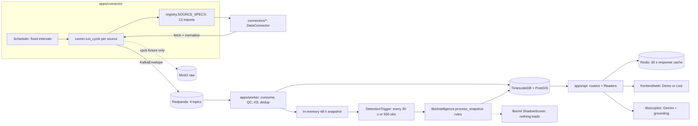

# Current-state audit

Status: written before the APAC migration began (2026-10-04), from the code on branch `sunil` at `4b48a2e`. Every claim names the file it came from. Line numbers are as of that commit.

Baseline checks at the start of the migration: `ruff check` clean, `pyright` 0 errors, `pytest tests/unit tests/contract` 503 passed. `ruff format --check` flagged only two design documents in `docs/` (Python snippets inside markdown).

## 1. Current architecture

### 1.1 Picture



### 1.2 Applications

| App | Entry point | Role |
| --- | --- | --- |
| `apps/connector` | `aeropulse-connector` | Interval loop; runs each due source, publishes contracts to Kafka |
| `apps/worker` | `aeropulse-worker` | Kafka consumer; QC, H3, dedup, Timescale upsert, in-memory snapshot, detection sweeps, shadow scoring |
| `apps/api` | `aeropulse-api`, `aeropulse-drift-monitor` | FastAPI, 39 paths, HS256 JWT, Redis cache |
| `libs/ml` CLI | `aeropulse-ml` | `train`, `models`, `promote`, `predict`, `parity`, `drift` |
| `frontend/web` | Vite | React 19 + MapLibre + deck.gl; Demo and Live modes |

### 1.3 Libraries

| Library | Contents |
| --- | --- |
| `libs/contracts` | Pydantic contracts with `schema_version` literals and `extra="forbid"`; `feature_spec.py` (ML feature names, `ml-features-2.0.0`) |
| `libs/connector_sdk` | `DataConnector` ABC, `FetchRequest`, `RawRecord`, `Cursor` watermarks, `LiveHttpClient` (rate limit, breaker, retry), quality scoring, fixture connector bases |
| `libs/geospatial` | H3 helpers (`DEFAULT_RESOLUTION = 8`), hardcoded gazetteer, fixture population |
| `libs/intelligence` | Rules: IDW estimator, anomaly, source likelihood, event engine, wind advection forecast, risk, lineage graph, keyword "CV" |
| `libs/ml` | Six sklearn HistGradientBoosting trainers, filesystem registry, inference, shadow, parity, drift |
| `libs/copilot` | Gemini tool loop, six tools, grounding validator, deterministic fallback |
| `libs/common` | Settings (`AEROPULSE_` prefix), errors, topics, MinIO helper |
| `libs/observability` | structlog JSON, Prometheus metrics, OpenTelemetry |
| `libs/auth` | HS256 JWT, seven roles |

### 1.4 Storage and queues

- TimescaleDB with PostGIS (17 tables, 8 hypertables; `infrastructure/db/migrations/0001-0007`). PostGIS is enabled but no Python code uses `ST_*`.
- Redpanda: `aero.observation.{air_quality,fire,weather,raster}`. `aero.citizen.reports` and the raw and DLQ topics exist in `topics.py` but are never published.
- MinIO: raw archive through `aeropulse_common/objects.py`, which builds `minio.Minio` directly and soft-fails to a URI that points at nothing.
- Redis: 30 s fail-open response cache for 10 GET paths (`apps/api/aeropulse_api/cache.py`).
- Filesystem: `models/` (joblib artifacts and `index.json`), `data/training/`.

### 1.5 External providers

| Provider | Connector | Live? | Auth |
| --- | --- | --- | --- |
| OpenAQ v3 | `connectors/openaq` | yes | `AEROPULSE_OPENAQ_API_KEY` header |
| NASA FIRMS area CSV | `connectors/firms` | yes | `AEROPULSE_FIRMS_MAP_KEY` in URL path (redacted in errors) |
| Open-Meteo forecast and air quality | `connectors/openmeteo` | yes | none |
| Gemini | `libs/copilot/gemini.py` | yes | API key |
| CPCB, IMD, Sentinel-5P, MODIS, CAMS, INSAT, Bhuvan, ICAR, industry, OSM | `connectors/*` | fixture replay only | — |
| Earth Engine | — | does not exist | — |

## 2. Current execution flow

```text
Provider (OpenAQ / FIRMS / Open-Meteo) or fixture file
  -> apps/connector/scheduler.py        due by wall-clock interval
  -> apps/connector/runner.py           _build_request: window from watermark (bbox never set)
  -> connector.fetch()                  geography from constants inside the connector
  -> connector.normalize()              Observation | FireObservation | MeteorologicalObservation | RasterObservation
  -> (cpcb only) archive the fixture file to MinIO
  -> KafkaEnvelope -> Redpanda topic chosen by contract type
  -> apps/worker/pipeline.py            evaluate_observation (QC), to_grid_id (H3 r8), dedup_key, Timescale upsert
  -> in-memory snapshot (48 h)          rasters skip QC and dedup
  -> DetectionTrigger                   every 30 s or 500 observations
  -> process_snapshot(snapshot, store)  history_by_grid NOT passed (pipeline.py:264)
       build_features (features.py)     fires not filtered by time; weather +-3 h
       estimate_pm25 (IDW)              mixes hours and CAMS (detect.py:76, estimator.py:40)
       detect_anomaly                   absolute 100 ug/m3 branch only
       score_sources                    fixed priors
       EventEngine                      new evidence ids every sweep
       forecast (wind-advection-0.1)    constant wind, 40-step (~37 km) cap
  -> Timescale persist; ShadowScorer (loads nothing: all artifacts are ml-features-1.0.0)
  -> apps/api routers -> Readers -> psycopg raw SQL (one connection per request)
       hazard/peak: carry-forward rule in apps/api/hazard_store.py, degraded
       empty database: ReplayFallback readers serve fixture points labelled cpcb/imd
  -> frontend/web services/resolve.ts   Demo or Live
```

There is no region, no cycle identity, no snapshot, and no served ML model.

## 3. Implementation inventory

| Area | Existing implementation | Location | Reuse | Refactor | Replace | Reason |
| --- | --- | --- | --- | --- | --- | --- |
| OpenAQ | Live v3 `/locations` + `/latest`, PM2.5/PM10, unit normalisation | `connectors/openaq/.../connector.py` | normalize, unit handling, timestamp parsing | bbox from context; archive raw | — | Hardcoded `DEFAULT_BBOX` (line 53) |
| FIRMS | Live area CSV, one product | `connectors/firms/.../connector.py` | CSV parsing, key redaction, confidence map | bbox from source domain; two products | — | Hardcoded bbox (line 54); fixture path has a second normalize branch |
| Open-Meteo | Live AQ + weather, five sites, future hours dropped | `connectors/openmeteo/.../connector.py` | wind components, hour parsing | sites from pack; keep forecast hours | — | `DEFAULT_SITES` (lines 89-95); no `issued_at` |
| Earth Engine | none | — | — | — | NEW | S5P aerosol index and WorldPop required by LLD |
| Ingestion | Static registry, runner, scheduler, Kafka publish | `apps/connector/*` | Cursor, LiveHttpClient, not-configured status | Plugin discovery, context injection | Static `SOURCE_SPECS` | Adding a source needs three edits; runner imports worker |
| Preprocessing | QC, H3, dedup inside worker per contract | `apps/worker/pipeline.py`, `connector_sdk/quality.py` | `evaluate_observation`, `dedup_key` | Shared steps for live and training | — | Logic exists only on the live path |
| Feature engineering | `build_features` used by training and serving | `libs/intelligence/features.py`, `libs/contracts/feature_spec.py` | Single implementation, leak guard | Time filtering, forecast weather, pack-driven flags | — | Future fires leak; weather +-3 h; `_STUBBLE_MONTHS` |
| PM2.5 model | `train_pm25_estimator`, HGB regressor | `libs/ml/train.py:290` | Bundle format idea | Family plugin, quantiles, horizons | Stale artifact | Trained on CAMS at 5 cells; `ml-features-1.0.0` |
| Hazard model | `train_pm25_hazard_24h`, uncalibrated | `libs/ml/train.py:977` | Label definition | Calibration slice, region threshold | Carry-forward serving | Never served; 121 hardcoded |
| Anomaly | Rule `detect_anomaly` + residual trainer | `libs/intelligence/anomaly.py`, `train.py:402` | Rule as fallback | Forecast-P90 residual | — | History never passed |
| Source likelihood | `score_sources` fixed priors | `libs/intelligence/likelihood.py` | As sanity baseline | Hazard-profile weights | Output type | Classes not region aware; label leak in trainer |
| Plume | `wind-advection-0.1` | `libs/intelligence/forecast.py` | Fallback and baseline | — | Lagrangian ensemble | 37 km cap, constant wind, no spread |
| Graph | Per-event lineage graph | `libs/intelligence/lineage.py`, `contracts/lineage.py` | Evidence edges | — | NEW incident graph | No cross-entity graph or incidents |
| Citizen AI | Keyword regex over notes | `libs/intelligence/cv.py`, `apps/api/routers/citizen.py` | Baseline for evaluation | — | Gemini observation + corroboration | Image never read; in-memory store |
| API | 11 routers, Readers over Timescale | `apps/api/*` | Auth, pagination, Reader protocol idea | Services over snapshots | Fixture reads, direct ML/connector calls | Layering violations; Live serves fixtures |
| Storage | psycopg raw SQL, MinIO helper | `apps/*/db.py`, `common/objects.py` | Parameterised SQL | — | Interfaces + adapters | No abstraction; soft-fail upload |
| Configuration | `config/sources.yaml`, Settings | `config/`, `libs/common/settings.py` | Settings pattern | Region packs | Unread `bbox` keys | Config split across YAML, registry, metadata |
| Region handling | none | — | — | — | NEW | Corridor repeated ~25 times |
| Frontend | Demo/Live via `resolve.ts`, one client | `frontend/web/src` | Client, resolve, Demo data | Region context | Hardcoded geo, wrong AQI bands | `aqi.ts` misses "Satisfactory" |
| Observability | structlog, Prometheus, OTel | `libs/observability` | All | Cycle and connector metrics | — | Works; extend |

## 4. Technical debt

### 4.1 Hardcoded region, coordinates, timezone

| Where | What |
| --- | --- |
| `libs/geospatial/aeropulse_geospatial/grid.py:14` | `DEFAULT_AOI = (73.5, 27.0, 78.5, 32.5)` |
| `connectors/openaq/.../connector.py:53`, `connectors/firms/.../connector.py:54` | `DEFAULT_BBOX = (73.8, 27.5, 78.5, 32.2)` twice |
| `connectors/openmeteo/.../connector.py:89-95` | Five corridor sites |
| `config/sources.yaml:27,38` | `bbox` keys that no code reads |
| `libs/geospatial/aeropulse_geospatial/gazetteer.py:56-91` | 27 corridor places |
| `libs/geospatial/aeropulse_geospatial/population.py` | Five fixture points, Delhi fallback density |
| `libs/intelligence/aeropulse_intelligence/risk.py` | `DENSITY_SCALE_PER_KM2` tuned to Delhi |
| `libs/contracts/aeropulse_contracts/feature_spec.py:150` | `_STUBBLE_MONTHS = {4, 5, 10, 11}` |
| `libs/ml/aeropulse_ml/registry.py:97` | `geography = "punjab-haryana-delhi-ncr"` |
| `libs/intelligence/aeropulse_intelligence/snapshot.py:27` | `MODEL_DERIVED_SOURCES = {"openmeteo", "cams"}` |
| `libs/ml/aeropulse_ml/train.py:536` | "Traffic hours" 6-10 applied to UTC timestamps |
| `frontend/web/src/utils/geo.ts:84-124` | `CORRIDOR_BOUNDS`, `PUNJAB_FIRE_CENTER`, bearing 146, wind 6 m/s, 10 places |
| `frontend/web/src/components/map/AeroMap.tsx:66` | `CORRIDOR_VIEW` |
| `frontend/web/src/utils/format.ts:11-31`, `api/adapters.ts:512-530` | `Asia/Kolkata` |
| `frontend/web/src/api/adapters.ts:145` | `toRegion` from latitude bands |
| `frontend/web/src/components/events/CitizenUploadForm.tsx:8`, `EventDetectMap.tsx:210-241` | Delhi defaults |

### 4.2 Hardcoded AQI values and thresholds

- `121.0` appears in `contracts/hazard.py:33`, `ml/train.py:69`, `ml/inference.py:290,398,454`, `frontend/web/src/services/hazardService.ts:17`, and the notebook toolkit (and as `120` in `propagation_toolkit.py:88`).
- CPCB bands: correct in `libs/copilot/tools.py:32-39`; **wrong** in `frontend/web/src/utils/aqi.ts:1-11` and `MapLegend.tsx:5-11` (five bands, "Satisfactory" missing, labels shifted, AQI formula capped at 300).
- Event severity 100/150/250 in `engine.py` is not CPCB.

### 4.3 Hardcoded source URLs

Provider base URLs are module constants in each connector (acceptable: they are the provider, not the region). Source ids are baked into fusion logic (`snapshot.py:27`).

### 4.4 Duplication

- Observation contracts restate eight identity, time, location, quality and provenance fields with no shared base.
- `is_live`, key lookup, lazy client and replay `health_check` are copy-pasted across the three live connectors.
- `rolling_origin_folds` exists in three notebook toolkits and `phase7_eval.py`; the notebooks duplicate the registry, gates, and fingerprinting and import nothing from `libs/`.
- `haversine_km` / `bearing_deg` in `libs/intelligence/geometry.py` and `anomaly_toolkit.py`.
- Connector configuration declared three times: `config/sources.yaml`, `registry.py` `SourceSpec`, and each `metadata.yaml`.
- Two `PRODUCTION` records for `pm25_estimator` in `models/index.json`.

### 4.5 Coupling and layering

- `apps/connector/runner.py:127` imports `aeropulse_worker.db`.
- `libs/ml/aeropulse_ml/cli.py:257` imports `aeropulse_api.drift_store` (a library depending on an app).
- API routers call `aeropulse_connector_app.registry` (`sources.py`), `aeropulse_intelligence.cv` and MinIO (`citizen.py`), `aeropulse_ml.drift`, read `fixtures/*.json` at request time (`map.py`, `risk.py`), and write the filesystem during a GET (`models.py:63`).
- Domain hazard rules live in the API app (`hazard_store.py:41-104`).
- Connectors read the global `get_settings()` singleton for mode, credentials, and age limits.

### 4.6 Large modules

`libs/ml/train.py` 1337, `apps/worker/db.py` 618, `libs/copilot/tools.py` 588, `libs/intelligence/features.py` 517, `apps/connector/runner.py` 505, `libs/ml/inference.py` 496, `frontend/.../EventDetectMap.tsx` 926, `AeroMap.tsx` 896, `api/live.ts` 607, `api/adapters.ts` 561.

### 4.7 Hidden global state

`EventStore` in memory, never pruned; worker snapshot lost on restart; `_OVERRIDES` dict in `routers/sources.py`; rate limiter dict that never evicts (`app.py:135`); `ModelBundleCache` memoises forever.

### 4.8 Correctness bugs on the served path

1. Forecast wind discarded (`drop_future_hours=True`), so the plume has no future wind.
2. Plume capped at ~37 km (`forecast.py:108`).
3. IDW mixes hours and includes CAMS (`detect.py:76`, `estimator.py:40`).
4. Anomaly never sees history (`pipeline.py:264`).
5. CAMS blend takes the last raster anywhere (`detect.py:159`).
6. Hazard/peak always carry-forward even with a champion (`hazard_store.py`).
7. Evidence and alert ids regenerated per sweep, so evidence grows and a HIGH event alerts every 30 s (`engine.py:224`, `alerts.py:20`).
8. Citizen linking skips HIGH and CRITICAL cells and `break`s on the first cell (`routers/citizen.py:76-81`).
9. Live with an empty database serves fixture points labelled `cpcb` and `imd` with no replay flag (`map_fixtures.py:88-145`).

### 4.9 ML leakage and skew

- Fires not time-filtered in `features.py:113` (future fires on multi-hour snapshots).
- Weather within +-3 h by absolute age (`snapshot.weather_within`, `features.py:276`).
- No purge between train and test for forward targets (`evaluation.temporal_split`).
- Source-likelihood features include `wind_speed` and hour encodings that the weak-label rule uses.
- Training uses Open-Meteo (CAMS) only; serving prefers ground stations.
- `validate_feature_contract` passes artifacts without a version field (`inference.py:97`); pm25 gate passes when skill is missing (`train.py:1153`).
- Every artifact in `models/` is `ml-features-1.0.0` and is rejected by the current loader.

### 4.10 Error handling and typing

- `normalize()` typed `Sequence[object]`; `is_live` discovered by `getattr`.
- Worker parse failures are logged and dropped, not dead-lettered.
- `/sources/{id}/test` reports healthy when no connector exists.
- No global FastAPI exception handler.

### 4.11 Test gaps

464 Python test functions; no architecture tests, no import-boundary tests, no golden cycle test, no frontend tests, no auth matrix beyond sources; `aeropulse-ml parity` is not in CI.

### 4.12 Performance

One psycopg connection per request, no pool; a count probe per request in `ReplayFallback` readers; a MinIO `bucket_exists` call per upload.

### 4.13 Security

| Finding | Location | Severity |
| --- | --- | --- |
| A working HS256 viewer JWT and the dev signing secret are committed | `infrastructure/docker/compose.yaml:153,267` | High: anyone with the repo can mint tokens for a stack running that secret |
| `jwt_secret` has a default and nothing refuses it outside development | `libs/common/aeropulse_common/settings.py:27` | High |
| `decode_token` does not require `exp`; no audience | `libs/auth/aeropulse_auth/jwt.py:141` | Medium |
| OIDC branch reads `alg` from the unverified header | `libs/auth/aeropulse_auth/jwt.py:131` | Medium (algorithm confusion) |
| Postgres and MinIO dev passwords inline in Compose | `compose.yaml` | Low (local dev) |
| Model artifacts loaded with `joblib` (pickle) | `libs/ml/inference.py:138` | Accepted trust boundary, documented |
| Frontend dev server runs as root | `frontend/web/Dockerfile` | Low |
| No certificates or PEM material found | — | n/a |

### 4.14 Configuration problems

`config/sources.yaml` keys `bbox`, `fixture`, `live_capable`, `auth_ref` are ignored; registry ids differ from `metadata.connector_id` for five sources; `data_source` table seeds IMD as enabled, contradicting "IMD stays off"; `Settings.default_h3_resolution` duplicates `DEFAULT_RESOLUTION` and is never read.

## 5. What is already good and kept

- One feature specification with an import-time target and derivation leak guard (`feature_spec.py`).
- Training already reuses the serving feature builder (`dataset.py` calls `build_features`).
- `LiveHttpClient` (rate limit, circuit breaker, retry, live-mode guard) and `Cursor` watermarks.
- Missing credentials produce `NOT_CONFIGURED` with zero records and no fixture fallback (`runner.py:301`).
- The grounding validator and deterministic fallback in `libs/copilot`.
- One HTTP client and one Demo/Live branch in the frontend.
- Structured logging, Prometheus metrics, and OTel tracing.
