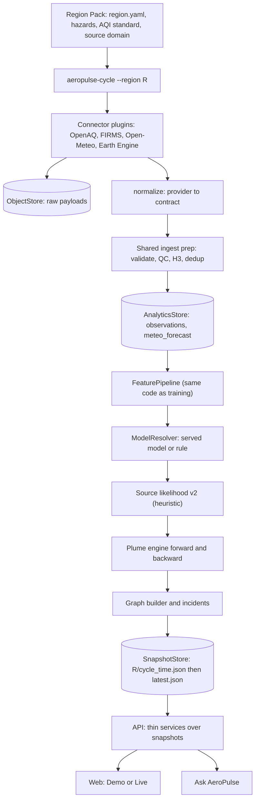

# Target architecture (APAC)

The design source of truth is [LLD_AeroPulse_APAC.md](../LLD_AeroPulse_APAC.md). This page is the engineering map: which package owns what, which way dependencies point, and the interfaces a contributor implements to extend the system. Gaps and conflicts with the old code are in [lld-gap-analysis.md](lld-gap-analysis.md); the order of work is in [migration-plan.md](migration-plan.md).

## 1. Runtime flow



Training uses the same middle of that picture: `DatasetSource -> shared preprocessing -> FeaturePipeline -> ModelPlugin.train -> evaluation strategies -> gate report`.

## 2. Packages and responsibilities

| Package | Owns | Must not |
| --- | --- | --- |
| `libs/contracts` | Every shared data shape, `ProvenanceClass`, `feature_spec.py` (feature names and version) | Import any other AeroPulse package except `common` |
| `libs/regions` | `RegionPack`, `HazardProfile`, `AqiStandard`, loader, validator, registry, `aeropulse-region` CLI | Know about providers or storage |
| `libs/connector_sdk` | `ConnectorPlugin`, `ConnectorContext`, `ConnectorResult`, plugin registry, shared `IngestPipeline`, HTTP client, cursors, QC | Contain geography |
| `connectors/*` | One provider each: request, parse, normalize | Hardcode a bbox, site, or timezone; leak vendor JSON past `normalize` |
| `libs/storage` | `ObjectStore`, `AnalyticsStore`, `SnapshotStore`, `ModelArtifactStore`, adapters, SQL/query templates, factory | Contain business rules |
| `libs/geospatial` | H3 helpers, gazetteer and population lookups (data from packs) | Hold place lists |
| `libs/intelligence` | Deterministic rules: detection, anomaly rule, likelihood, risk, `plume/`, `graph/`, `corroboration.py`, feature computation | Import an LLM SDK or a cloud SDK |
| `libs/ml` | `preprocessing/`, `features/`, `datasets/`, `models/` (plugins), `evaluation/`, `baselines/`, `serving/`, `postprocess.py`, CLI | Import an app or an LLM SDK |
| `libs/vision` | Photo sanitising, geo check, `VisualObserver` (Gemini behind `LLMClient`) | Produce events, predictions, or labels |
| `libs/copilot` | Agent tools, prompts, grounding validator | Compute a scientific value |
| `apps/cycle` | Orchestration of one `(region_id, cycle_time)` | Contain domain logic |
| `apps/citizen_analyzer` | Queue consumer for citizen reports | Change an event |
| `apps/api` | Thin routers over services over store interfaces | Load models, call connectors, compute features |
| `apps/connector`, `apps/worker` | Legacy path, kept until the API switch is complete | Gain new features |

## 3. Dependency direction

```text
apps (api, cycle, citizen_analyzer)
  -> domain libs (intelligence, ml, copilot, vision)
    -> platform libs (regions, connector_sdk, storage interfaces, geospatial, observability, common)
      -> contracts
adapters (GCS, BigQuery, MinIO, Parquet, Gemini, Earth Engine) implement platform interfaces;
apps choose them through aeropulse_storage.factory (AEROPULSE_PLATFORM=local|gcp).
```

Enforced by `tests/architecture/test_import_boundaries.py`. Cloud SDK imports (`google.cloud`, `minio`, `ee`) are allowed only inside adapter modules; `google.genai` only inside `libs/copilot` and `libs/vision` adapters.

## 4. Extension points

### 4.1 New data source

1. Create `connectors/<name>/` with a class satisfying `ConnectorPlugin`:

```python
class ConnectorPlugin(Protocol):
    source_id: str
    supported_contracts: frozenset[str]
    provenance_class: ProvenanceClass
    # None when runnable; otherwise the reason shown as "not configured".
    def configuration_issue(self, context: ConnectorContext) -> str | None: ...
    def fetch(self, context: ConnectorContext) -> ConnectorResult: ...
    def normalize(self, result: ConnectorResult, context: ConnectorContext) -> list[CanonicalRecord]: ...
    def health(self, context: ConnectorContext) -> SourceHealth: ...
```

2. Register it under the `aeropulse.connectors` entry point in its `pyproject.toml`.
3. Add it to a region pack's `sources:` with `params` and a `secret_ref` name.
4. Add a contract test: provider fixture to canonical contract.

`ConnectorContext` carries the region id, the resolved bbox for the requested `Domain` (display or source), sites, the time window and watermark, params, a credential resolver, the processing mode, and the fixture path for replay. The shared `IngestPipeline` archives the raw payload, calls `normalize`, validates contracts, applies QC, assigns H3, and dedups. Nothing in the cycle, ML, API, or frontend changes unless a new contract type is introduced.

### 4.2 New preprocessing step

Implement `PreprocessingStep.apply(batch, context) -> (batch, dropped_by_reason)` in `libs/ml/aeropulse_ml/preprocessing/steps.py` and add it to `default_steps()` in `preprocessing/pipelines.py`, which both training and the cycle use; bump `PREPROCESSING_VERSION`. A batch is a `RecordBatch` of canonical records; steps never mutate their input. Add a unit test for the step and, if it touches time, a leak test.

### 4.3 New feature

Add the name to a group in `libs/contracts/aeropulse_contracts/feature_spec.py`, record any derivation in `DERIVED_FROM`, compute it in the feature computation, and bump `ML_FEATURE_VERSION`. Old artifacts then refuse to load, and `aeropulse-ml parity` checks that training and inference produce the same value.

### 4.4 New model

Implement `ModelPlugin` (`family`, `train`, `predict`, `evaluate`, `save`, `load`) in `libs/ml/aeropulse_ml/models/<family>/` and register it in `models/registry.py`. Training, evaluation strategies, baselines, gate reports, and serving are shared.

### 4.5 New region

Add `config/regions/<id>/region.yaml` (and, optionally, `stations.json`, gazetteer and population files), referencing existing hazard profiles and an AQI standard. Run `aeropulse-region validate <id>`. No code changes; `tests/architecture` and the synthetic-pack test enforce this.

### 4.6 New storage provider

Implement the relevant protocol in `libs/storage/aeropulse_storage/adapters/` and select it in `factory.py`.

### 4.7 New deployment environment

Set `AEROPULSE_PLATFORM` and the adapter settings. Domain code does not change.

## 5. Cross-cutting rules

- **Provenance.** Every served value carries a `provenance_class`: `measured`, `model_derived`, `predicted`, `simulated`, `heuristic`, `ai_observation`, `citizen`.
- **Degraded.** Every prediction states `model_version`, `degraded`, and `degraded_reason`; hazard also states `calibrated`.
- **Missing values** are `null` with a `field_status` reason; the UI renders "—" with that reason.
- **Leakage.** Lags use hours `< t`; forecast weather requires `issued_at <= t`; fires and satellite use `observed_at <= t`; labels come only from `ground_truth_sources`; CAMS is a feature and a baseline, never a label.
- **Serving.** Only `config/model_serving.yaml` entries whose gate report passed for that region and whose feature version matches are served. Training never writes that file.
- **Snapshots.** The versioned object is written before `latest.json` is repointed. `mode` is `live` or `backfill`, never `demo`.
- **Demo.** Demo data lives in `frontend/web/src/data/` and is generated from fixtures by running the real code. It is never written to serving storage.
- **Errors.** Typed errors in `aeropulse_common.errors`; no bare `except Exception: pass`; every degraded result has a reason.
- **Observability.** Each cycle stage logs `region_id`, `cycle_id`, `stage`, `duration_ms`, `record_count`, `error_count`, and model and feature versions, and updates the Prometheus metrics in `aeropulse_observability.metrics`.
